# Azure AKS Basic Example

This example composes a **private Azure Kubernetes Service cluster** with a minimal self-contained VNet, Azure Bastion operator access, NAT Gateway egress, and a small private jump host.

It is the public teaser-tier counterpart to the premium `aks_firewall_transit` blueprint. Move to that blueprint when the architecture requires Azure Firewall transit, ACR, customer-managed keys, additional node pools, or broader governance.

## Architecture Overview

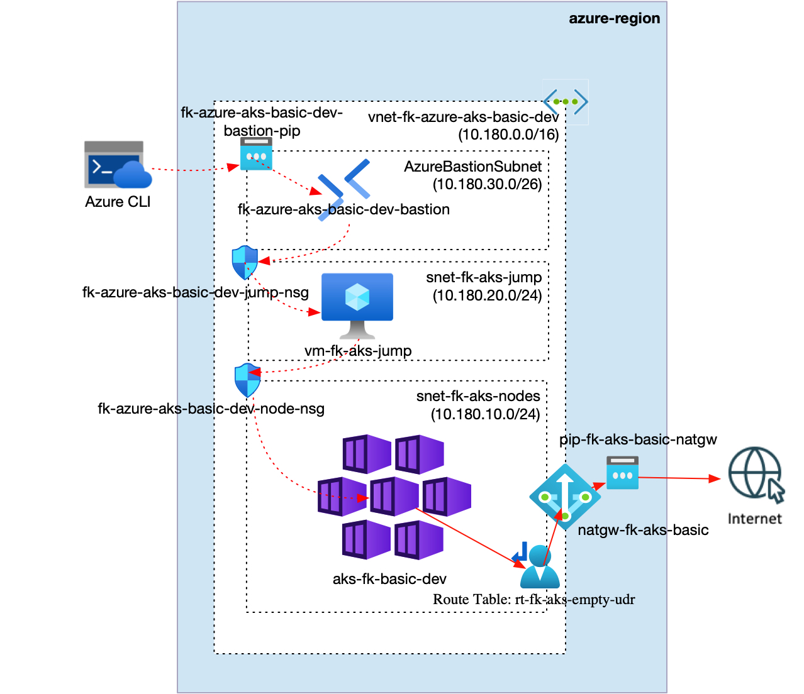

**Figure 1.** Azure AKS basic private cluster architecture.

The `aks_basic` pattern composes one VNet with an AKS node subnet, a dedicated jump subnet, and `AzureBastionSubnet`; separate subnet-associated NSGs for AKS nodes and the jump host; one empty route table associated to the AKS node subnet for AKS `userDefinedRouting`; one NAT Gateway associated to the AKS node and jump subnets; one private AKS cluster; one Azure Bastion host; and one private Linux jump host used to validate private AKS API reachability.

## What This Example Deploys

- one Resource Group
- one VNet
- one AKS node subnet
- one private jump subnet
- one `AzureBastionSubnet`
- one NSG associated to the AKS node subnet
- one NSG associated to the jump subnet
- one empty route table associated to the AKS node subnet
- one NAT Gateway with a public IP for outbound egress from the AKS node and jump subnets
- one private AKS cluster using Azure CNI
- one Azure Bastion host for SSH access to the private jump host
- one lightweight Linux jump host used to validate private AKS API TCP `443` reachability

## Pattern

- [`patterns/azure/aks_basic`](../../../../patterns/azure/aks_basic/README.md)

## Files

- [landing-zone.yaml](landing-zone.yaml)
- [main.tf](main.tf)
- [providers.tf](providers.tf)
- [variables.tf](variables.tf)
- [outputs.tf](outputs.tf)
- [terraform.tfvars.example](terraform.tfvars.example)

## Deploy

```bash
cp terraform.tfvars.example terraform.tfvars
tofu init
tofu validate
tofu plan
tofu apply
```

Replace the placeholder values in `terraform.tfvars` before planning.

## Validation Flow

After a manual apply, use the `jump_host.ssh_command` output to connect to the private jump host through Azure Bastion, then validate AKS private API reachability:

```bash
az network bastion ssh --name <bastion-name> --resource-group <resource-group-name> --target-resource-id <jump-vm-id> --auth-type ssh-key --username azureuser --ssh-key <path-to-private-key>
getent hosts <aks-private-fqdn>
nc -vz <aks-private-fqdn> 443
```

Expected result:

- AKS exposes a private FQDN
- TCP port `443` is reachable from the private jump host
- the jump host has no public IP and operator SSH goes through Azure Bastion
- direct Internet-originated inbound traffic to the AKS node subnet is denied by NSG
- AKS uses `outbound_type = "userDefinedRouting"` with an empty route table, while the subnet-associated NAT Gateway provides outbound egress for private nodes

## Validation Result

Validation output from the deployed example through Azure Bastion:

```text
== client host ==
vm-fk-aks-jump

== client addresses ==
10.180.20.4
lo               UNKNOWN        127.0.0.1/8 ::1/128
eth0             UP             10.180.20.4/24 metric 100 fe80::20d:3aff:fe2e:6e40/64

== aks private dns ==
10.180.10.4     aks-fk-basic-dev-jfpxuv41.343499fb-c03e-4038-b544-b97708374e03.privatelink.westeurope.azmk8s.io

== aks tcp 443 ==
Connection to aks-fk-basic-dev-jfpxuv41.343499fb-c03e-4038-b544-b97708374e03.privatelink.westeurope.azmk8s.io (10.180.10.4) 443 port [tcp/https] succeeded!

== aks https /version ==
HTTP/2 401
audit-id: 9558a1fe-e141-48d0-b1c0-d38530d870a0
cache-control: no-cache, private
content-type: application/json
content-length: 157
date: Thu, 17 Sep 2026 08:59:40 GMT

{
  "kind": "Status",
  "apiVersion": "v1",
  "metadata": {},
  "status": "Failure",
  "message": "Unauthorized",
  "reason": "Unauthorized",
  "code": 401
}
```

The `401 Unauthorized` response is expected for an unauthenticated API request. It confirms that the private AKS API endpoint is reachable from the jump host through private DNS and TCP `443`.

## Azure Portal Verification

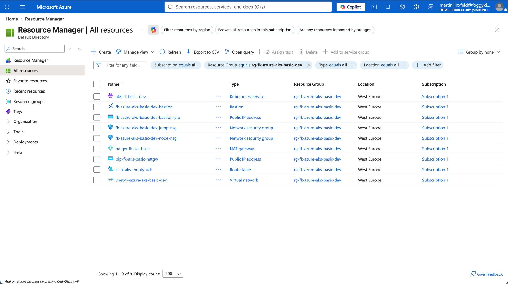

**Figure 2.** Resource Group overview after deployment.

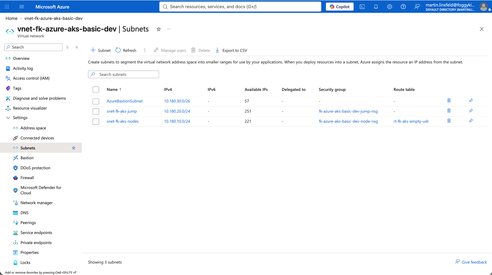

**Figure 3.** VNet subnets for AKS nodes, jump host, and Azure Bastion.

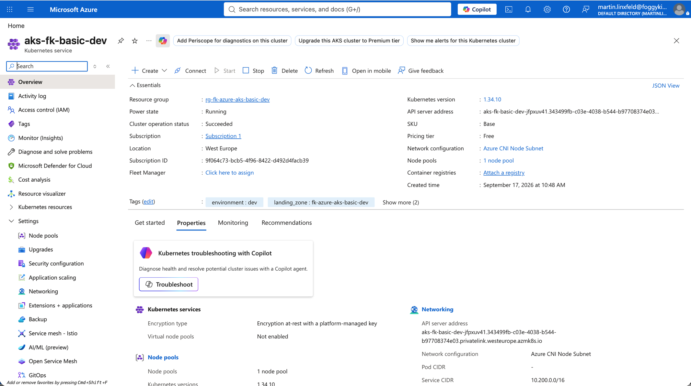

**Figure 4.** AKS overview with private API server address.

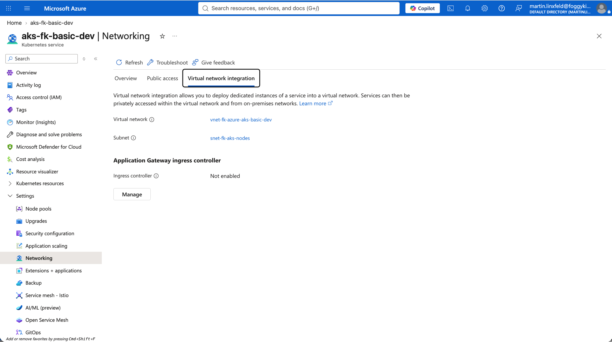

**Figure 5.** AKS virtual network integration with the node subnet.

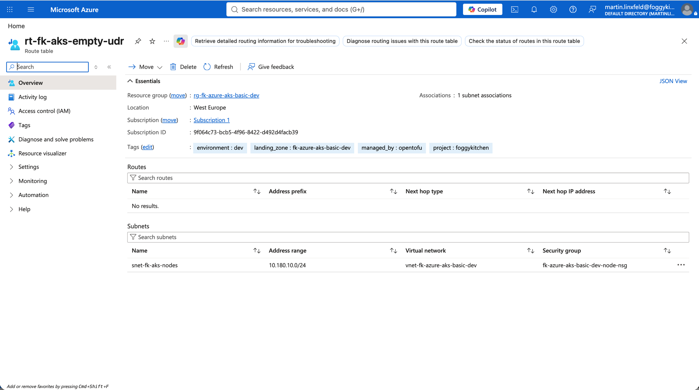

**Figure 6.** Empty route table associated to the AKS node subnet for `userDefinedRouting`.

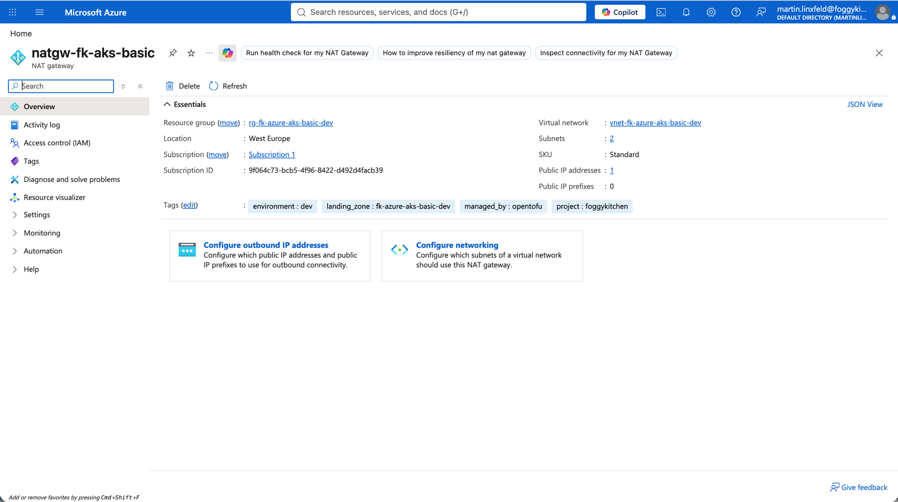

**Figure 7.** NAT Gateway used for outbound egress from the private AKS and jump subnets.

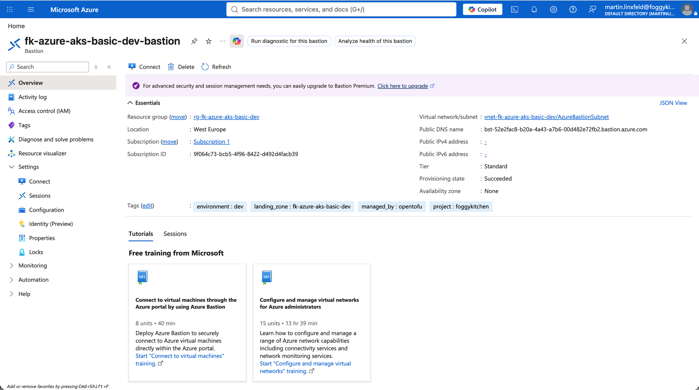

**Figure 8.** Azure Bastion used for operator access to the private jump host.

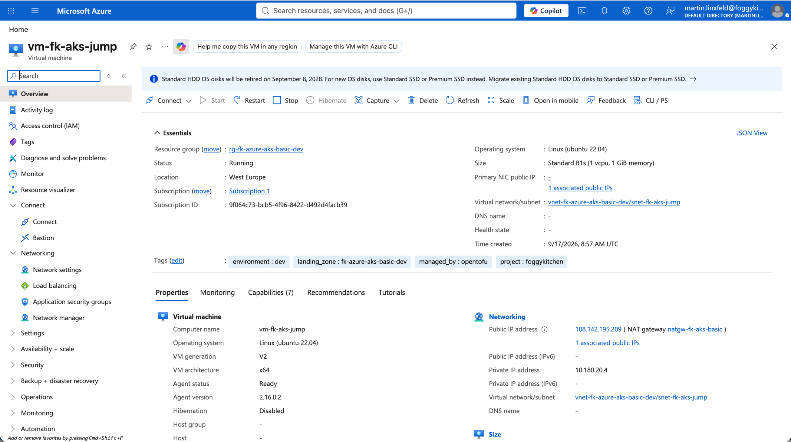

**Figure 9.** Private jump VM networking in the dedicated jump subnet.

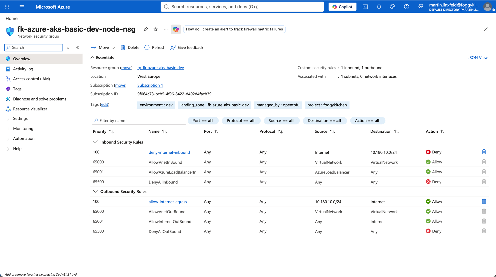

**Figure 10.** AKS node subnet NSG rules denying direct Internet inbound traffic.

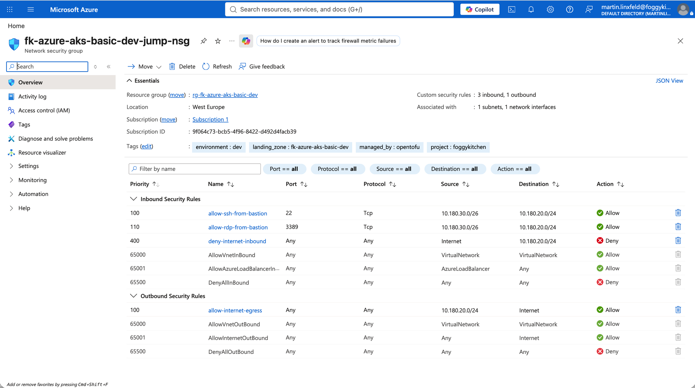

**Figure 11.** Jump subnet NSG rules allowing SSH only from the Bastion subnet and denying direct Internet inbound traffic.

## Destroy

```bash
tofu destroy
```

## Notes

- `admin_ssh_public_key` is a sensitive Terraform variable and is injected into `landing-zone.yaml` with `templatefile`.
- This basic variant does not configure Azure Firewall, hub-and-spoke topology, ACR, customer-managed keys, additional node pools, autoscaling, diagnostics, Log Analytics, multi-region, cross-region, or disaster recovery configuration.
- `terraform-az-fk-aks v2.0.0` exposes `kubeconfig_raw`, but this orchestrator pattern deliberately does not output raw kubeconfig or secrets.
- This implementation follows the FoggyKitchen `terraform-az-fk-aks` `training/03-private-cluster` lab: `userDefinedRouting` is intentional, the AKS node subnet has an associated empty route table, and NAT Gateway provides the outbound internet path for private nodes.

## Learn More

- [FoggyKitchen Azure AKS Terraform Course](https://foggykitchen.com/courses/azure-aks-terraform-course)
- [Create a private Azure Kubernetes Service cluster](https://learn.microsoft.com/en-us/azure/aks/private-clusters)
- [Customize AKS cluster egress with outbound types](https://learn.microsoft.com/en-us/azure/aks/egress-outboundtype)
- [Create a managed or user-assigned NAT Gateway for AKS](https://learn.microsoft.com/en-us/azure/aks/nat-gateway)
- [Design virtual networks with Azure NAT Gateway](https://learn.microsoft.com/en-us/azure/nat-gateway/nat-gateway-design)
- [Create an SSH connection to a Linux VM using Azure Bastion](https://learn.microsoft.com/en-us/azure/bastion/bastion-connect-vm-ssh-linux)

## License

Licensed under the **Universal Permissive License (UPL), Version 1.0**.
See [LICENSE](../../../../LICENSE) for details.

© 2026 [FoggyKitchen.com](https://foggykitchen.com) - Cloud. Code. Clarity.
