# Azure AKS Private ACR Example

This example composes a **private Azure Kubernetes Service cluster** with a private Azure Container Registry reachable through Azure Private Link, Azure Bastion operator access, NAT Gateway egress, and a private jump host.

It extends the public `aks_basic` teaser-tier shape by adding one ACR Premium registry, one ACR Private Endpoint, and the `privatelink.azurecr.io` Private DNS Zone. Move to the premium `aks_firewall_transit` blueprint when the architecture requires Azure Firewall transit, hub-and-spoke networking, customer-managed keys, multiple node pools, or broader platform governance.

## Architecture Overview

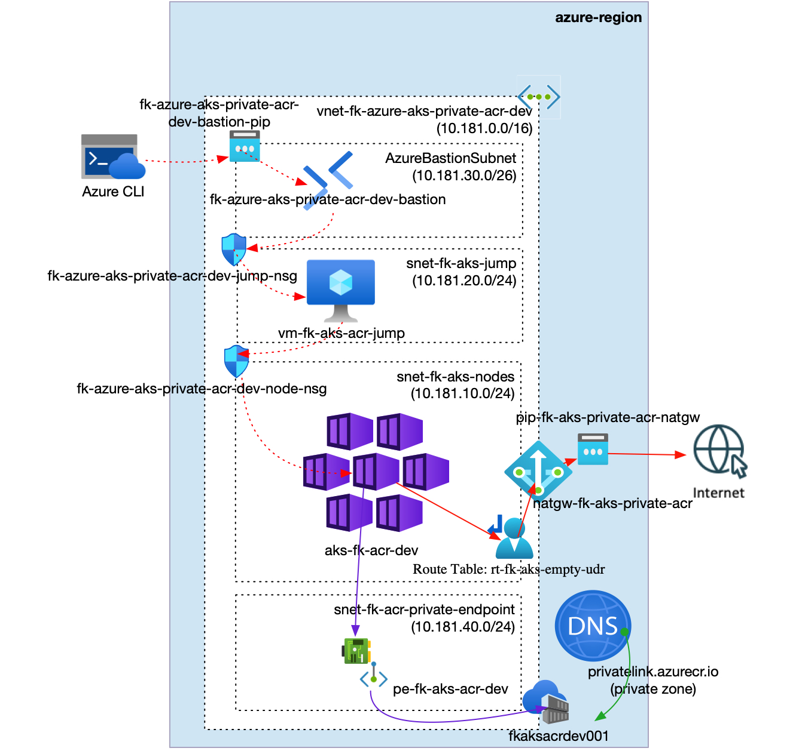

**Figure 1.** Azure AKS private cluster with private ACR access through Private Endpoint and Private DNS.

The `aks_private_acr` pattern composes one VNet with an AKS node subnet, a dedicated jump subnet, a dedicated ACR Private Endpoint subnet, and `AzureBastionSubnet`; subnet-associated NSGs for AKS nodes and the jump host; one empty route table associated to the AKS node subnet for AKS `userDefinedRouting`; one NAT Gateway associated to the AKS node and jump subnets; one private AKS cluster; one private Azure Container Registry; one ACR Private Endpoint with Private DNS integration; one Azure Bastion host; and one private Linux jump host used to validate private AKS API and ACR reachability.

## What This Example Deploys

- one Resource Group
- one VNet
- one AKS node subnet
- one private jump subnet
- one ACR Private Endpoint subnet
- one `AzureBastionSubnet`
- one NSG associated to the AKS node subnet
- one NSG associated to the jump subnet
- one empty route table associated to the AKS node subnet
- one NAT Gateway with a public IP for outbound egress from the AKS node and jump subnets
- one private AKS cluster using Azure CNI
- one Azure Container Registry Premium registry with public network access disabled
- one ACR Private Endpoint using subresource `registry`
- one Private DNS Zone named `privatelink.azurecr.io`
- one Azure Bastion host for SSH access to the private jump host
- one lightweight Linux jump host used to validate private AKS API TCP `443` and private ACR TCP `443` reachability

## Pattern

- [`patterns/azure/aks_private_acr`](../../../../patterns/azure/aks_private_acr/README.md)

## Files

- [landing-zone.yaml](landing-zone.yaml)
- [main.tf](main.tf)
- [providers.tf](providers.tf)
- [variables.tf](variables.tf)
- [outputs.tf](outputs.tf)
- [terraform.tfvars.example](terraform.tfvars.example)

## Deploy

```bash
cp terraform.tfvars.example terraform.tfvars
tofu init
tofu validate
tofu plan
tofu apply
```

Replace the placeholder values in `terraform.tfvars` before planning.

## Validation Flow

After a manual apply, use the `jump_host.ssh_command` output to connect to the private jump host through Azure Bastion, then validate AKS private API and ACR private endpoint reachability:

```bash
az network bastion ssh --name <bastion-name> --resource-group <resource-group-name> --target-resource-id <jump-vm-id> --auth-type ssh-key --username azureuser --ssh-key <path-to-private-key>
getent hosts <aks-private-fqdn>
nc -vz <aks-private-fqdn> 443
getent hosts <acr-login-server>
nc -vz <acr-login-server> 443
```

Expected result:

- AKS exposes a private FQDN
- TCP port `443` is reachable from the private jump host to the AKS API
- ACR resolves through the VNet-linked `privatelink.azurecr.io` Private DNS Zone
- TCP port `443` is reachable from the private jump host to the ACR login server
- the jump host has no public IP and operator SSH goes through Azure Bastion
- direct Internet-originated inbound traffic to the AKS node and jump subnets is denied by NSG
- ACR public network access remains disabled
- AKS has `AcrPull` access to the registry through a role assignment to the AKS kubelet identity

## Azure Portal Verification

Capture the following after a manual apply:

- `azure_aks_private_acr_resource_group_overview.jpg` - Resource Group overview after deployment
- `azure_aks_private_acr_vnet_subnets.jpg` - VNet subnets for AKS nodes, jump host, ACR Private Endpoint, and Azure Bastion
- `azure_aks_private_acr_aks_overview.jpg` - AKS overview with private API server address and attached ACR
- `azure_aks_private_acr_aks_networking.jpg` - AKS networking with node subnet integration
- `azure_aks_private_acr_acr_overview.jpg` - ACR overview with Premium SKU
- `azure_aks_private_acr_acr_networking.jpg` - ACR networking showing public network access disabled and Private Endpoint access enabled
- `azure_aks_private_acr_private_endpoint.jpg` - ACR Private Endpoint overview
- `azure_aks_private_acr_private_endpoint_dns.jpg` - ACR Private Endpoint DNS configuration
- `azure_aks_private_acr_private_dns_zone.jpg` - Private DNS Zone records for `privatelink.azurecr.io`
- `azure_aks_private_acr_route_table.jpg` - empty route table associated to the AKS node subnet
- `azure_aks_private_acr_nat_gateway.jpg` - NAT Gateway overview
- `azure_aks_private_acr_bastion_overview.jpg` - Azure Bastion overview
- `azure_aks_private_acr_jump_vm_networking.jpg` - private jump VM networking
- `azure_aks_private_acr_node_nsg_rules.jpg` - AKS node subnet NSG rules
- `azure_aks_private_acr_jump_nsg_rules.jpg` - jump subnet NSG rules

## Deployment Evidence

**Resource Group overview**

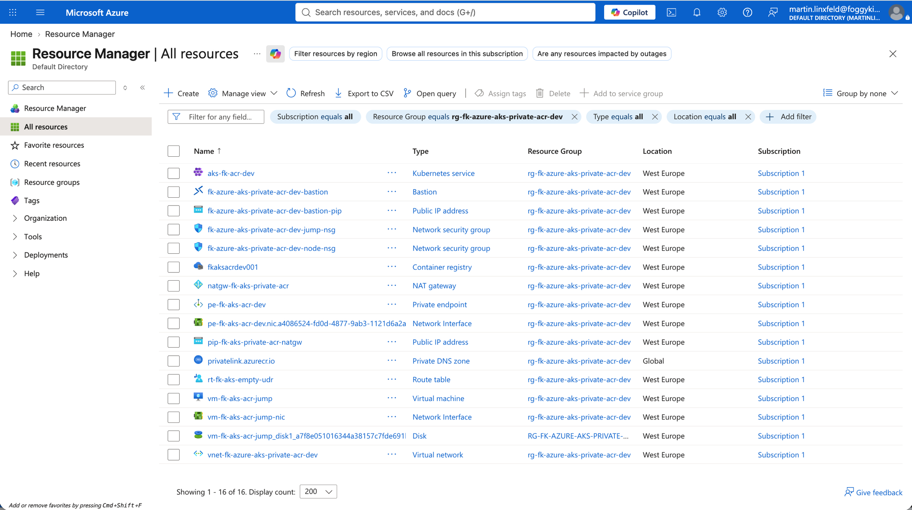

**VNet subnets**

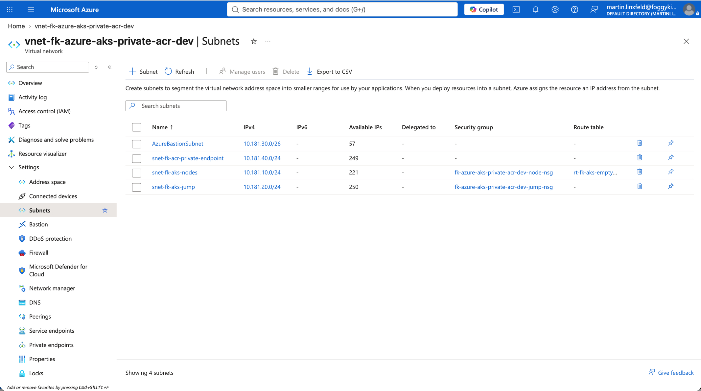

**AKS overview**

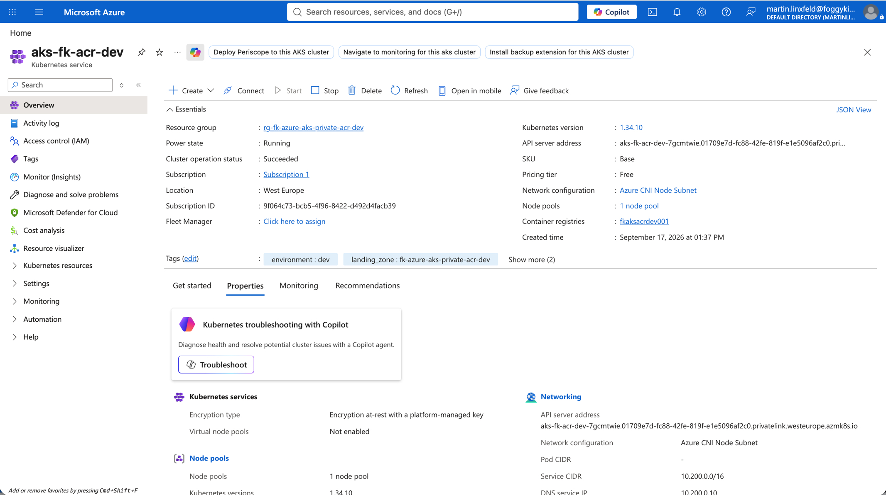

**AKS networking**

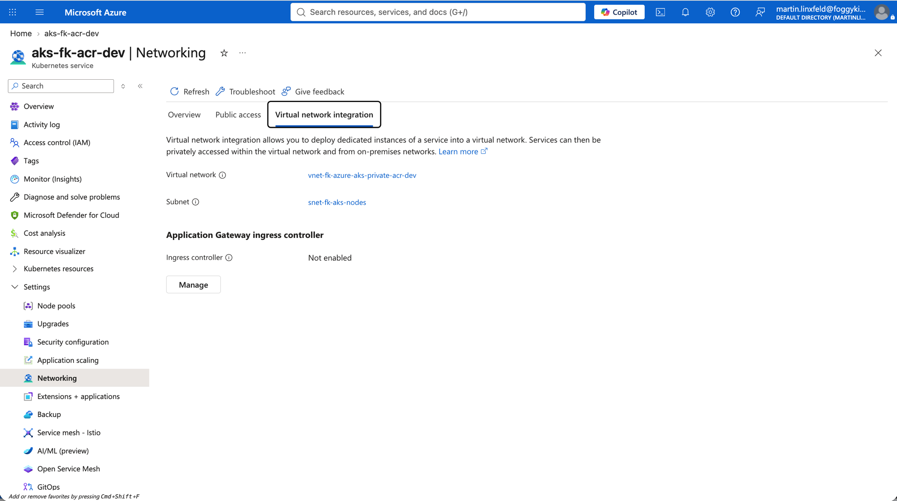

**ACR overview**

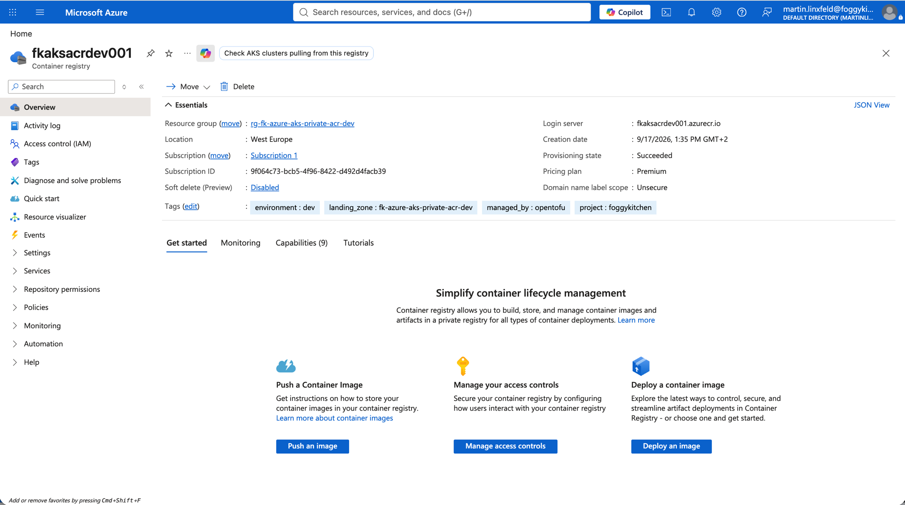

**ACR networking**

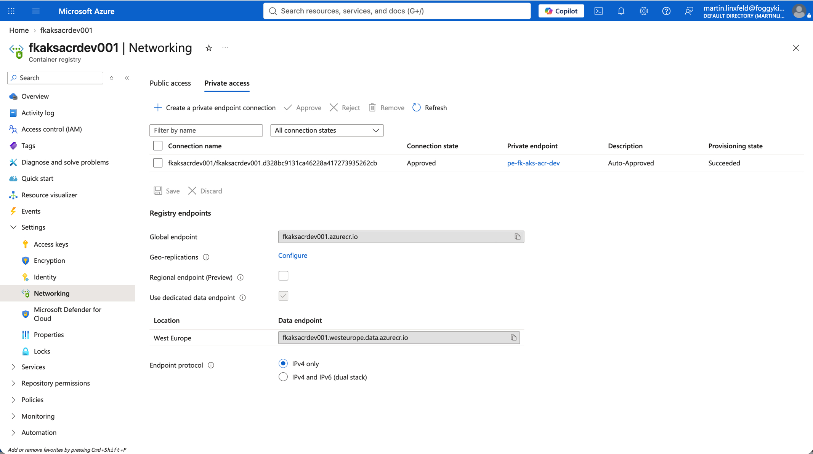

**ACR Private Endpoint**

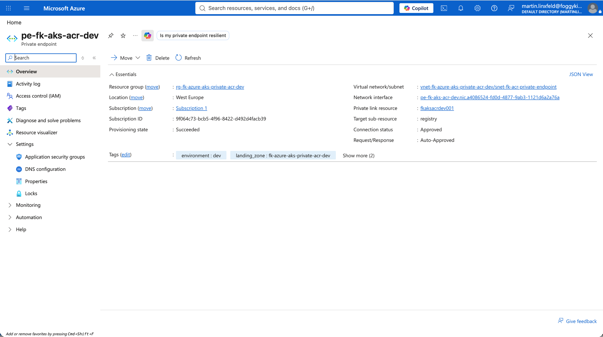

**ACR Private Endpoint DNS configuration**

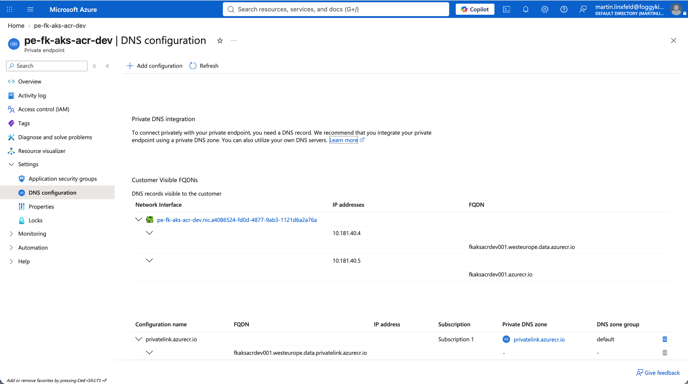

**Private DNS Zone records**

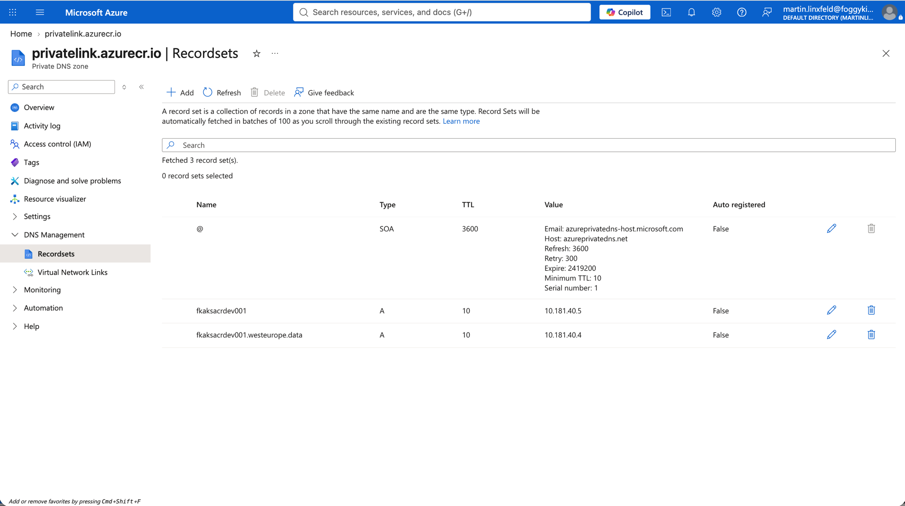

**AKS route table**

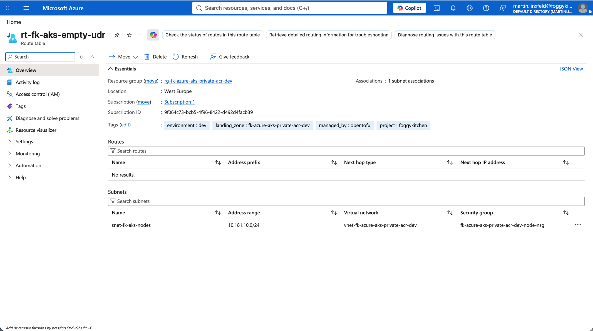

**NAT Gateway**

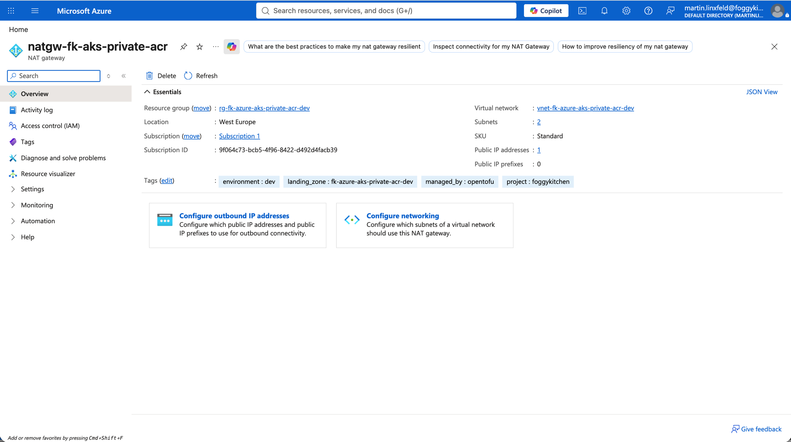

**Azure Bastion**

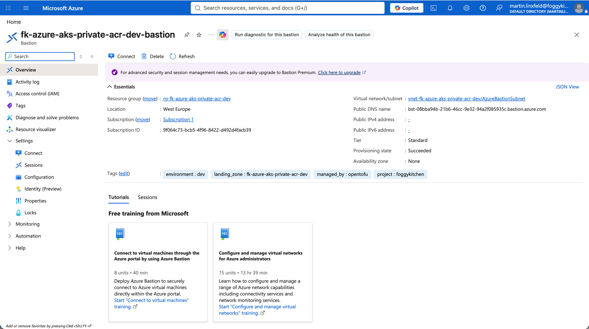

**Jump VM networking**

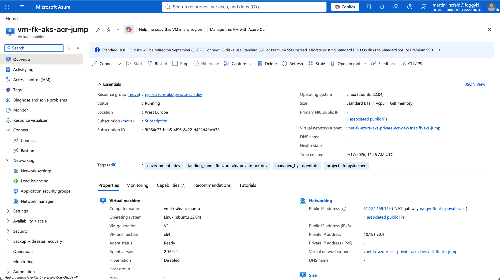

**AKS node subnet NSG rules**

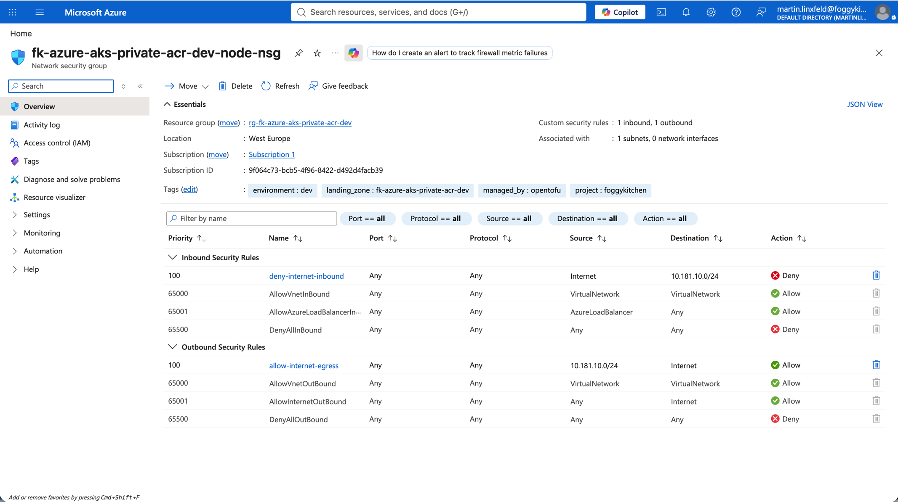

**Jump subnet NSG rules**

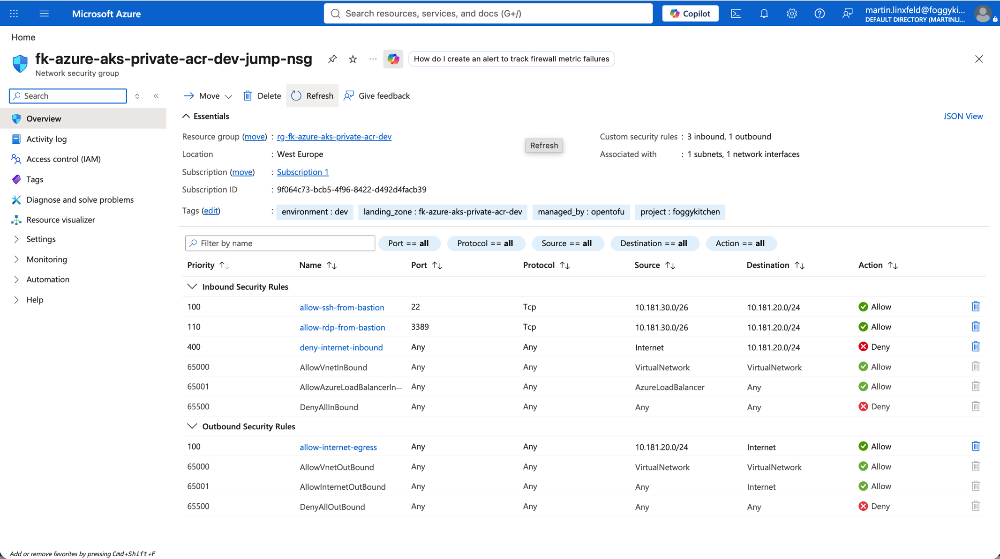

## Destroy

```bash
tofu destroy
```

## Notes

- `admin_ssh_public_key` is a sensitive Terraform variable and is injected into `landing-zone.yaml` with `templatefile`.
- This private ACR variant does not configure Azure Firewall, hub-and-spoke topology, customer-managed keys, additional node pools, autoscaling, diagnostics, Log Analytics, multi-region, cross-region, or disaster recovery configuration.
- The pattern assigns `AcrPull` to the AKS kubelet identity after AKS and ACR exist.
- `terraform-az-fk-acr v0.2.0` creates the registry only; Private Endpoint and Private DNS are composed separately by this pattern.

## Learn More

- [FoggyKitchen Azure AKS Terraform Course](https://foggykitchen.com/courses/azure-aks-terraform-course)
- [Create a private Azure Kubernetes Service cluster](https://learn.microsoft.com/en-us/azure/aks/private-clusters)
- [Connect privately to an Azure Container Registry using Azure Private Link](https://learn.microsoft.com/en-us/azure/container-registry/container-registry-private-link)
- [Azure private endpoint DNS configuration](https://learn.microsoft.com/en-us/azure/private-link/private-endpoint-dns)
- [Customize AKS cluster egress with outbound types](https://learn.microsoft.com/en-us/azure/aks/egress-outboundtype)
- [Create a managed or user-assigned NAT Gateway for AKS](https://learn.microsoft.com/en-us/azure/aks/nat-gateway)
- [Create an SSH connection to a Linux VM using Azure Bastion](https://learn.microsoft.com/en-us/azure/bastion/bastion-connect-vm-ssh-linux)

## License

Licensed under the **Universal Permissive License (UPL), Version 1.0**.
See [LICENSE](../../../../LICENSE) for details.

© 2026 [FoggyKitchen.com](https://foggykitchen.com) - Cloud. Code. Clarity.
