# Azure Cosmos DB Private Access - Private Endpoint Example

This example composes **Azure Cosmos DB SQL API** with Private Endpoint access, Azure Bastion operator access, and a small private validation host in the same VNet.

It is reshaped into a reusable `foggykitchen-landing-zone-orchestrator` pattern and payload from the current `terraform-az-fk-cosmosdb` Private Endpoint example.

## Architecture Overview

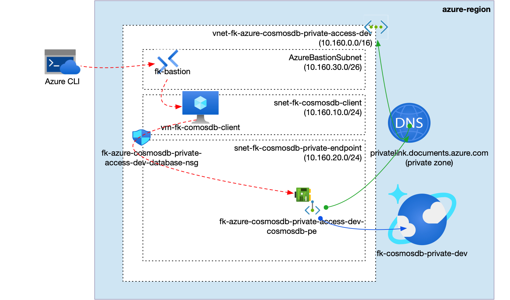

**Figure 1.** Azure Cosmos DB SQL API Private Endpoint architecture.

The `cosmosdb_private_access` pattern composes one VNet with a validation host subnet, `AzureBastionSubnet`, one Private Endpoint subnet, one subnet-associated NSG, one Azure Bastion host, one Private DNS Zone linked to the VNet, one Cosmos DB SQL API account with public network access disabled, one SQL database, one SQL container, and one Private Endpoint with DNS Zone Group.

## What This Example Deploys

- one Resource Group
- one VNet
- one client subnet
- one `AzureBastionSubnet`
- one Private Endpoint subnet
- one NSG associated to the client and Private Endpoint subnets
- one Azure Bastion host for SSH access to the private validation host
- one Private DNS Zone linked to the VNet
- one Cosmos DB SQL API account with public network access disabled
- one Cosmos DB SQL database
- one Cosmos DB SQL container
- one Private Endpoint and Private DNS Zone Group
- one lightweight compute host used to validate private DNS and TCP `443` reachability

## Pattern

- [`patterns/azure/cosmosdb_private_access`](../../../../../../patterns/azure/cosmosdb_private_access/README.md)

## Files

- [landing-zone.yaml](landing-zone.yaml)
- [main.tf](main.tf)
- [providers.tf](providers.tf)
- [variables.tf](variables.tf)
- [outputs.tf](outputs.tf)
- [terraform.tfvars.example](terraform.tfvars.example)

## Deploy

```bash
cp terraform.tfvars.example terraform.tfvars
tofu init
tofu plan
tofu apply
```

Replace the placeholder values in `terraform.tfvars` before planning.

## Validation Flow

After apply, use the `validation_host.ssh_command` output to connect to the private validation host through Azure Bastion, then validate Cosmos DB reachability:

```bash
az network bastion ssh --name <bastion-name> --resource-group <resource-group-name> --target-resource-id <validation-vm-id> --auth-type ssh-key --username azureuser --ssh-key <path-to-private-key>
getent hosts <cosmosdb-account-name>.documents.azure.com
nc -vz <cosmosdb-account-name>.documents.azure.com 443
curl -I https://<cosmosdb-account-name>.documents.azure.com:443/
```

Expected result:

- TCP port `443` is reachable from the validation host
- Cosmos DB resolves through the VNet-linked Private DNS Zone
- the validation host has no public IP and operator SSH goes through Azure Bastion
- public network access on the Cosmos DB account remains disabled
- no Cosmos DB IP firewall rules are created

## Validation Result

Validation output from the deployed example through Azure Bastion:

```text
== client host ==
vm-fk-cosmosdb-client

== client addresses ==
10.160.10.4

== cosmosdb dns ==
10.160.20.4     fk-cosmosdb-private-dev.privatelink.documents.azure.com fk-cosmosdb-private-dev.documents.azure.com

== cosmosdb tcp 443 ==
Connection to fk-cosmosdb-private-dev.documents.azure.com (10.160.20.4) 443 port [tcp/https] succeeded!

== cosmosdb https ==
HTTP/2 401
content-type: application/json
server: Microsoft-HTTPAPI/2.0
strict-transport-security: max-age=31536000
```

## Azure Portal Verification

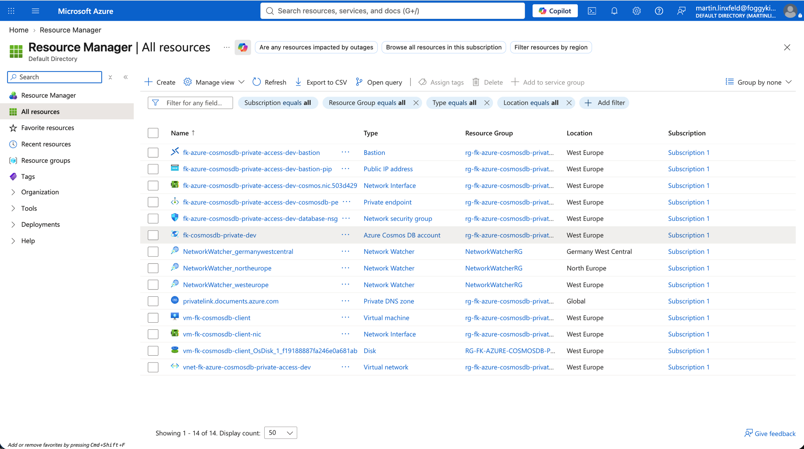

**Figure 2.** Resource Group overview after deployment.

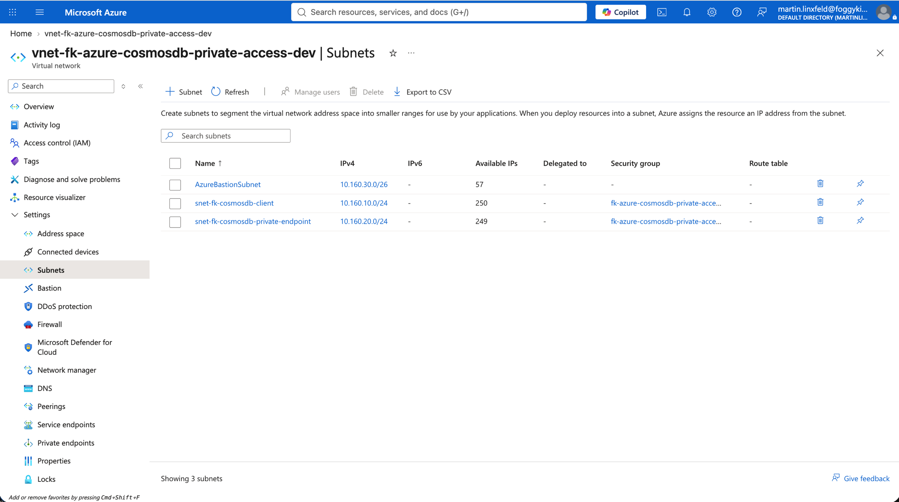

**Figure 3.** VNet subnets for client, Bastion, and Cosmos DB Private Endpoint access.

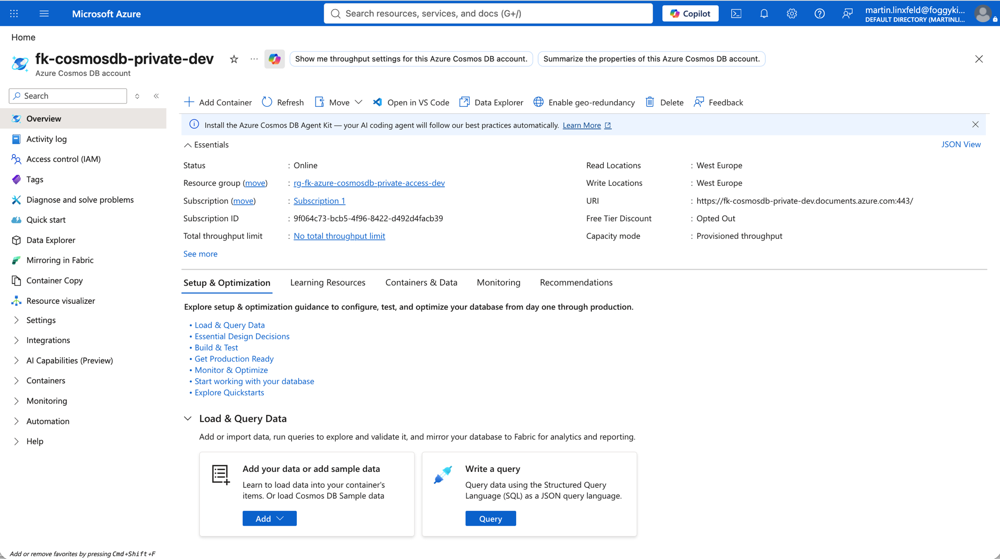

**Figure 4.** Cosmos DB account overview.

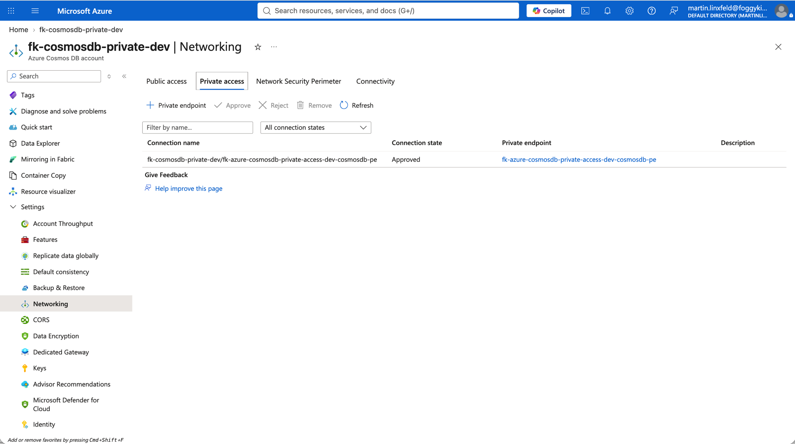

**Figure 5.** Cosmos DB networking with public access disabled and Private Endpoint access enabled.

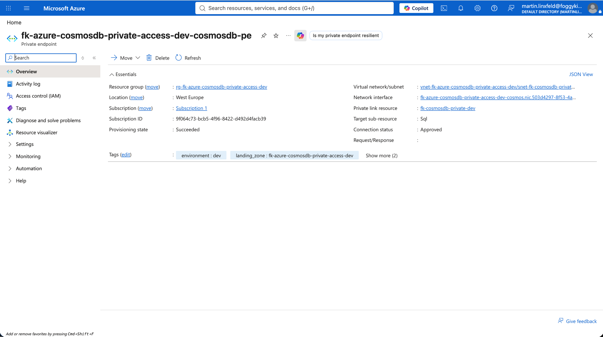

**Figure 6.** Private Endpoint connected to the Cosmos DB account.

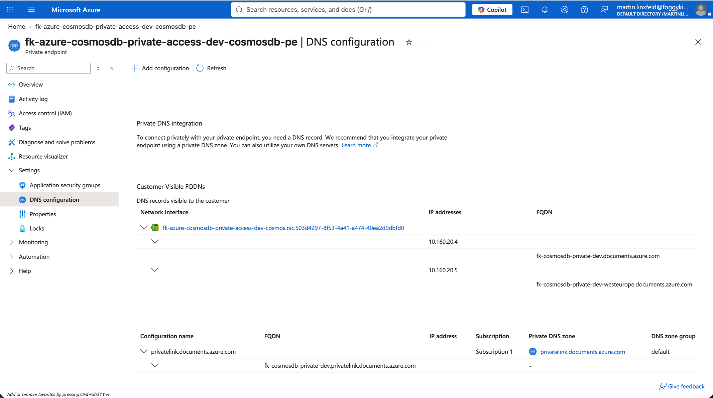

**Figure 7.** Private Endpoint DNS configuration for Cosmos DB SQL API.

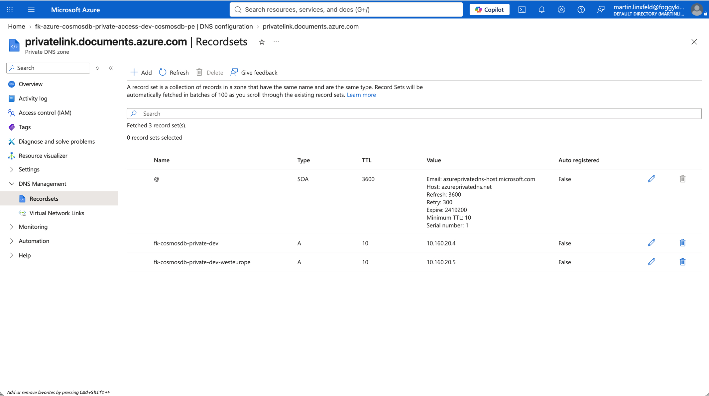

**Figure 8.** Private DNS Zone records for the Cosmos DB Private Endpoint.

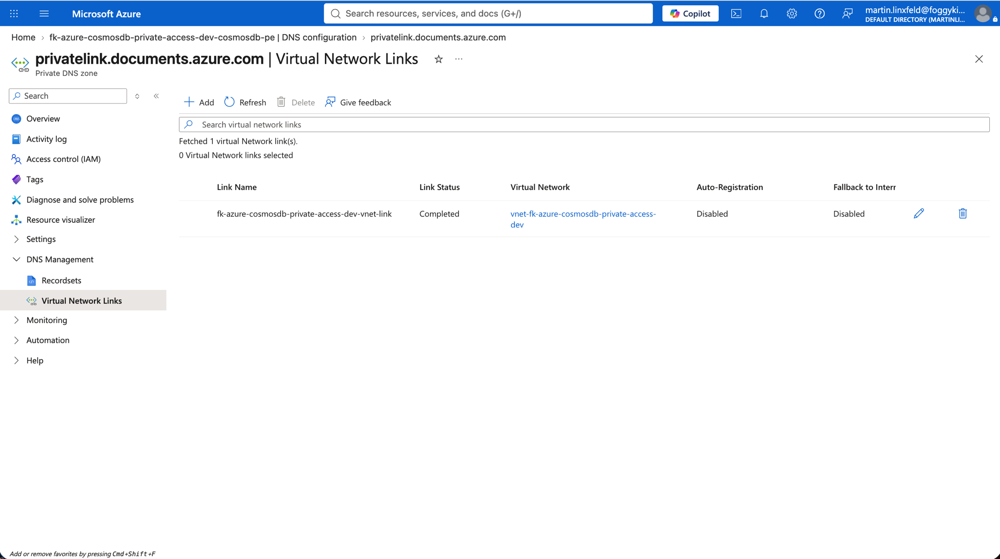

**Figure 9.** Private DNS Zone VNet link for private Cosmos DB name resolution.

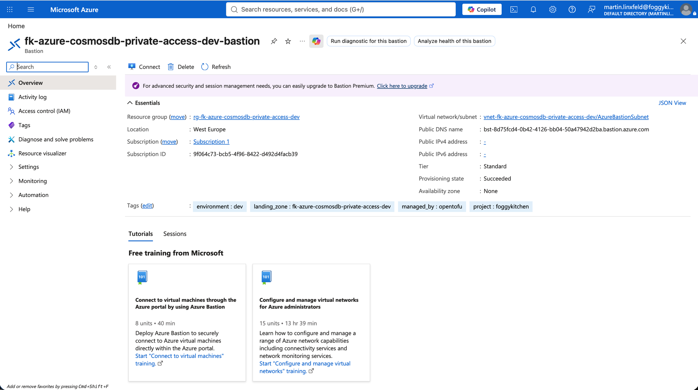

**Figure 10.** Azure Bastion used for operator access to the private validation host.

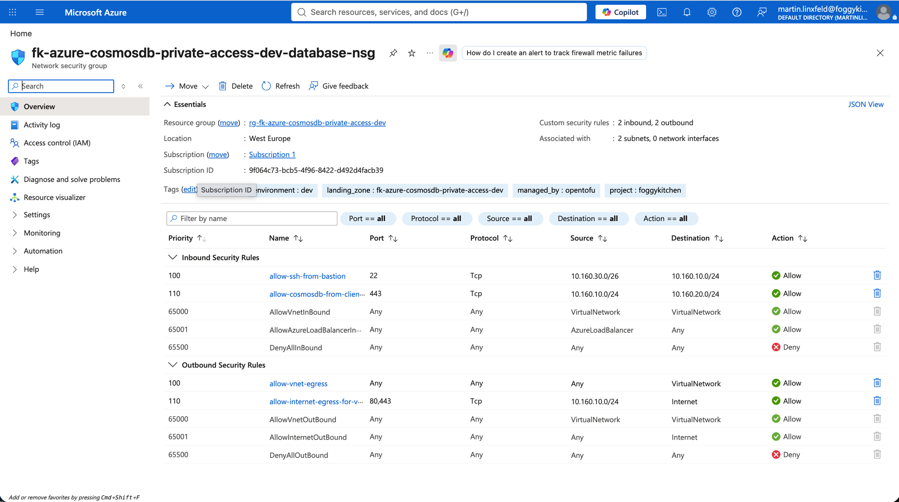

**Figure 11.** NSG rules for Bastion SSH and Cosmos DB HTTPS reachability.

## Destroy

```bash
tofu destroy
```

## Notes

- `admin_ssh_public_key` is a sensitive Terraform variable and is injected into `landing-zone.yaml` with `templatefile`.
- This Private Endpoint variant does not configure local-auth disablement, Cosmos DB data-plane RBAC assignments, managed identity, customer-managed keys, or Azure Monitor diagnostics.
- Cosmos DB has no Entra administrator concept. A future secure variant should use `local_authentication_enabled = false` plus data-plane RBAC role assignments, and `key_vault_key_id` / `default_identity_type` for CMK.
- Multi-region Cosmos DB, richer app-to-data topologies, cross-region failover, disaster recovery, schema bootstrap, and governance belong in later PRs or the private blueprint layer.
- `terraform-az-fk-compute v0.3.5` deploys the validation host with a private NIC. Azure Bastion provides the operator access path.

## License

Licensed under the **Universal Permissive License (UPL), Version 1.0**.
See [LICENSE](../../../../../../LICENSE) for details.

© 2026 [FoggyKitchen.com](https://foggykitchen.com) - Cloud. Code. Clarity.
