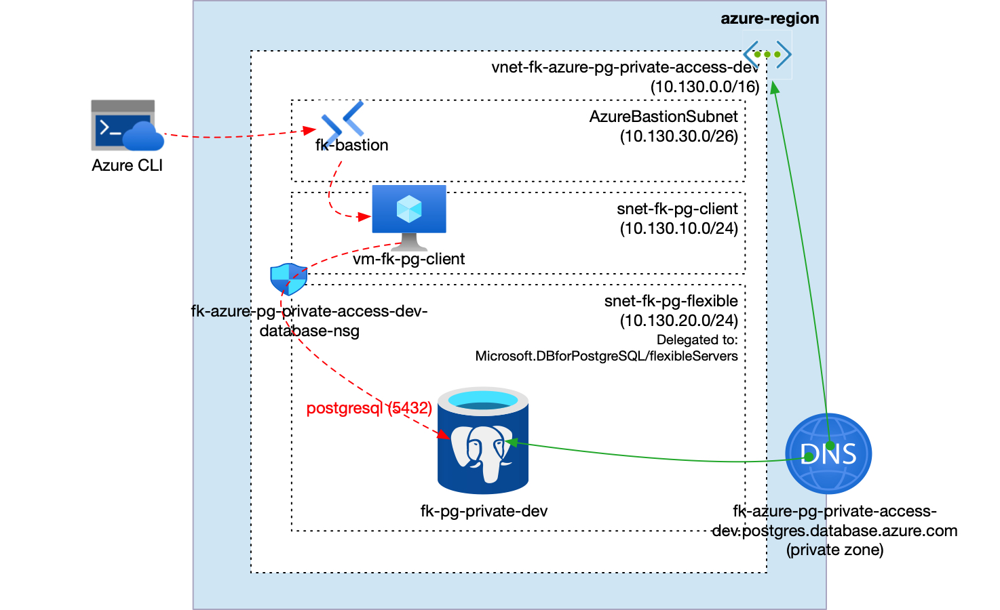
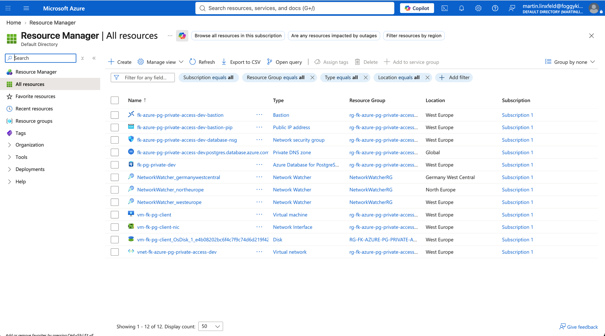
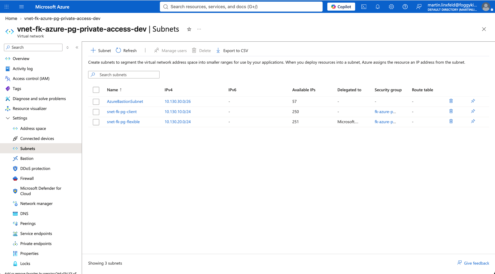
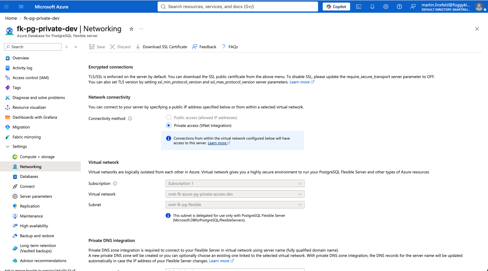
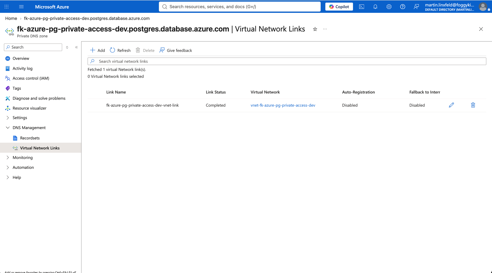
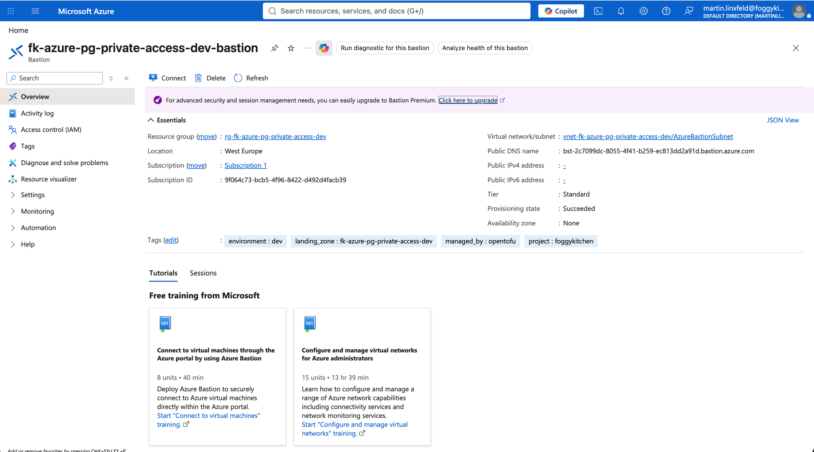
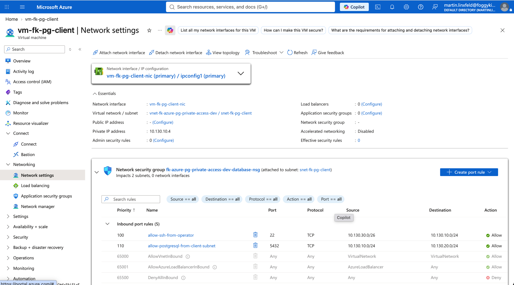
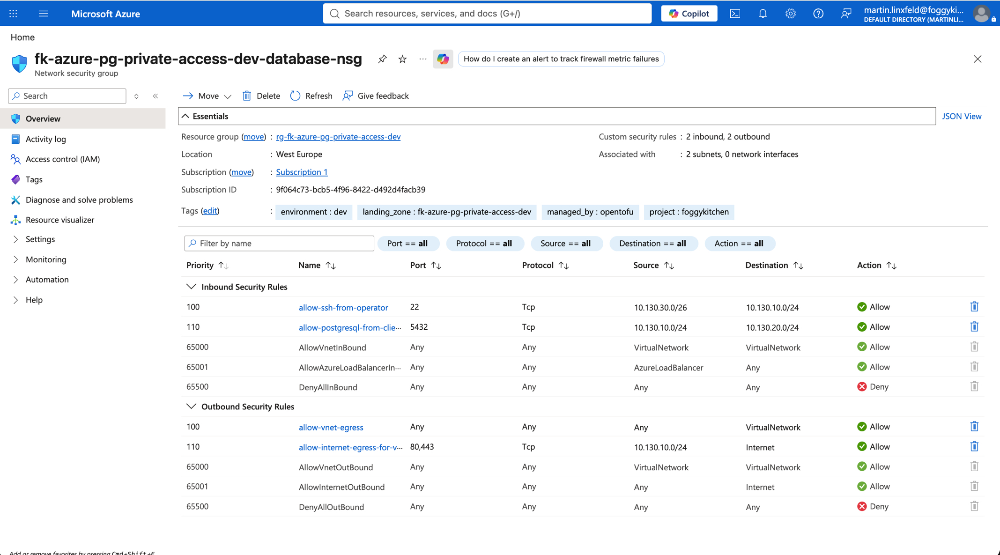

# Azure PostgreSQL Private Access - Delegated Subnet Example

This example composes **Azure Database for PostgreSQL Flexible Server** with delegated-subnet private access, Azure Bastion operator access, and a small private validation host in the same VNet.

It is reshaped into a reusable `foggykitchen-landing-zone-orchestrator` pattern and payload from the current `terraform-az-fk-pg` delegated-subnet example.

## Architecture Overview



The `postgresql_private_access` pattern composes one VNet with a validation host subnet, `AzureBastionSubnet`, one PostgreSQL delegated subnet, one subnet-associated NSG, one Azure Bastion host, one Private DNS Zone linked to the VNet, and one PostgreSQL Flexible Server with public network access disabled.

## Deployment Screenshots















## What This Example Deploys

- one Resource Group
- one VNet
- one client subnet
- one `AzureBastionSubnet`
- one delegated PostgreSQL subnet
- one NSG associated to both subnets
- one Azure Bastion host for SSH access to the private validation host
- one Private DNS Zone linked to the VNet
- one PostgreSQL Flexible Server using delegated-subnet private access
- one PostgreSQL database
- one lightweight compute host used to validate private TCP `5432` reachability

## Pattern

- [`patterns/azure/postgresql_private_access`](../../../../../../patterns/azure/postgresql_private_access/README.md)

## Files

- [landing-zone.yaml](landing-zone.yaml)
- [main.tf](main.tf)
- [providers.tf](providers.tf)
- [variables.tf](variables.tf)
- [outputs.tf](outputs.tf)
- [terraform.tfvars.example](terraform.tfvars.example)

## Deploy

```bash
cp terraform.tfvars.example terraform.tfvars
tofu init
tofu plan
tofu apply
```

Replace the placeholder values in `terraform.tfvars` before planning.

## Validation Flow

After apply, use the `validation_host.ssh_command` output to connect to the private validation host through Azure Bastion, then validate PostgreSQL reachability:

```bash
az network bastion ssh --name <bastion-name> --resource-group <resource-group-name> --target-resource-id <validation-vm-id> --auth-type ssh-key --username azureuser --ssh-key <path-to-private-key>
nc -vz <postgresql-flexible-server-fqdn> 5432
psql "host=<postgresql-flexible-server-fqdn> port=5432 dbname=foggydb user=pgadmin sslmode=require"
```

Expected result:

- TCP port `5432` is reachable from the validation host
- PostgreSQL resolves through the VNet-linked Private DNS Zone
- the validation host has no public IP and operator SSH goes through Azure Bastion
- public network access on PostgreSQL Flexible Server remains disabled
- no PostgreSQL firewall rules are created

Validation output from the deployed example:

```text
== client host ==
vm-fk-pg-client

== client addresses ==
10.130.10.4

== postgres dns ==
10.130.20.4     e37efecb4511.fk-azure-pg-private-access-dev.postgres.database.azure.com fk-pg-private-dev.postgres.database.azure.com

== postgres tcp 5432 ==
Connection to fk-pg-private-dev.postgres.database.azure.com (10.130.20.4) 5432 port [tcp/postgresql] succeeded!
```

## Destroy

```bash
tofu destroy
```

## Notes

- `postgresql_admin_password` and `admin_ssh_public_key` are sensitive Terraform variables and are injected into `landing-zone.yaml` with `templatefile`.
- This delegated-subnet variant does not configure Microsoft Entra authentication, customer-managed keys, or Azure Monitor diagnostics.
- Private Endpoint mode, richer app-to-data topologies, cross-region replicas, disaster recovery, schema bootstrap, and governance belong in later PRs or the private blueprint layer.
- `terraform-az-fk-compute v0.3.5` deploys the validation host with a private NIC. Azure Bastion provides the operator access path.

## License

Licensed under the **Universal Permissive License (UPL), Version 1.0**.
See [LICENSE](../../../../../../LICENSE) for details.

© 2026 [FoggyKitchen.com](https://foggykitchen.com) - Cloud. Code. Clarity.
