# Azure PostgreSQL Private Access - Private Endpoint Example

This example composes **Azure Database for PostgreSQL Flexible Server** with Private Endpoint access, Azure Bastion operator access, and a small private validation host in the same VNet.

It extends the reusable `foggykitchen-landing-zone-orchestrator` `postgresql_private_access` pattern with the PostgreSQL Flexible Server Private Link path from the current `terraform-az-fk-pg` Private Endpoint example.

## Architecture Overview

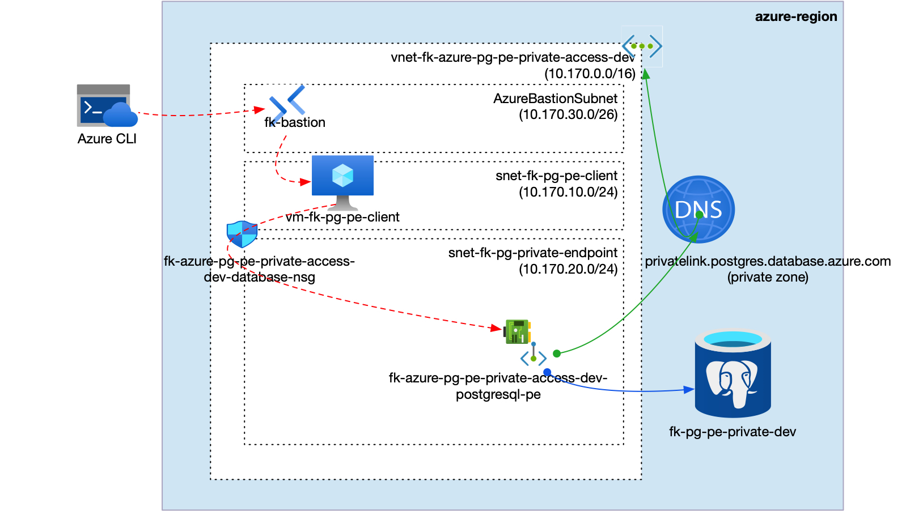

**Figure 1.** Azure PostgreSQL Private Endpoint private access architecture.

The `postgresql_private_access` pattern composes one VNet with a validation host subnet, `AzureBastionSubnet`, one Private Endpoint subnet, one subnet-associated NSG, one Azure Bastion host, one Private DNS Zone linked to the VNet, one PostgreSQL Flexible Server with public network access disabled, one PostgreSQL database, and one Private Endpoint with DNS Zone Group.

## What This Example Deploys

- one Resource Group
- one VNet
- one client subnet
- one `AzureBastionSubnet`
- one Private Endpoint subnet
- one NSG associated to the client and Private Endpoint subnets
- one Azure Bastion host for SSH access to the private validation host
- one Private DNS Zone linked to the VNet
- one PostgreSQL Flexible Server with public network access disabled
- one PostgreSQL database
- one Private Endpoint and Private DNS Zone Group
- one lightweight compute host used to validate private TCP `5432` reachability

## Pattern

- [`patterns/azure/postgresql_private_access`](../../../../../../patterns/azure/postgresql_private_access/README.md)

## Files

- [landing-zone.yaml](landing-zone.yaml)
- [main.tf](main.tf)
- [providers.tf](providers.tf)
- [variables.tf](variables.tf)
- [outputs.tf](outputs.tf)
- [terraform.tfvars.example](terraform.tfvars.example)

## Deploy

```bash
cp terraform.tfvars.example terraform.tfvars
tofu init
tofu plan
tofu apply
```

Replace the placeholder values in `terraform.tfvars` before planning.

## Validation Flow

After apply, use the `validation_host.ssh_command` output to connect to the private validation host through Azure Bastion, then validate PostgreSQL reachability:

```bash
az network bastion ssh --name <bastion-name> --resource-group <resource-group-name> --target-resource-id <validation-vm-id> --auth-type ssh-key --username azureuser --ssh-key <path-to-private-key>
getent hosts <postgresql-flexible-server-fqdn>
nc -vz <postgresql-flexible-server-fqdn> 5432
psql "host=<postgresql-flexible-server-fqdn> port=5432 dbname=foggydb user=pgadmin sslmode=require"
```

Expected result:

- TCP port `5432` is reachable from the validation host
- PostgreSQL resolves through the VNet-linked Private DNS Zone
- the validation host has no public IP and operator SSH goes through Azure Bastion
- public network access on PostgreSQL Flexible Server remains disabled
- no PostgreSQL firewall rules are created

## Validation Result

Validation output from the deployed example through Azure Bastion:

```text
== client host ==
vm-fk-pg-pe-client

== client addresses ==
10.170.10.4

== postgres dns ==
10.170.20.4     fk-pg-pe-private-dev.privatelink.postgres.database.azure.com fk-pg-pe-private-dev.postgres.database.azure.com

== postgres tcp 5432 ==
Connection to fk-pg-pe-private-dev.postgres.database.azure.com (10.170.20.4) 5432 port [tcp/postgresql] succeeded!

== postgres psql ==
 current_database | current_user
------------------+--------------
 foggydb          | pgadmin
(1 row)
```

## Azure Portal Verification

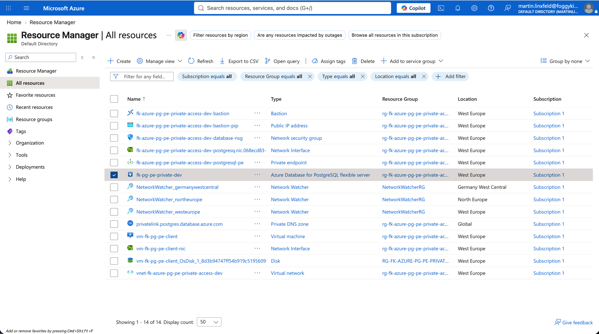

**Figure 2.** Resource Group overview after deployment.

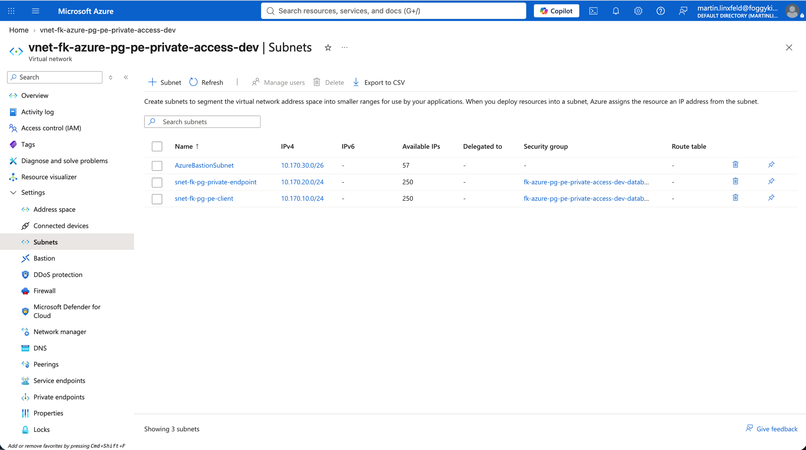

**Figure 3.** VNet subnets for client, Bastion, and PostgreSQL Private Endpoint access.

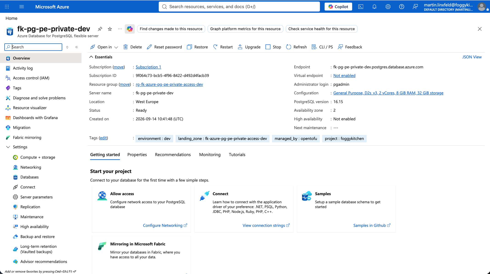

**Figure 4.** PostgreSQL Flexible Server overview.

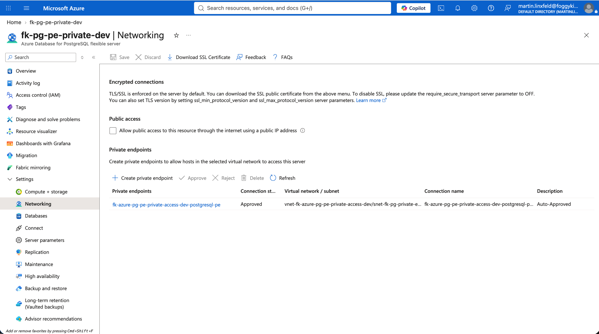

**Figure 5.** PostgreSQL Flexible Server networking with public access disabled and Private Endpoint access enabled.

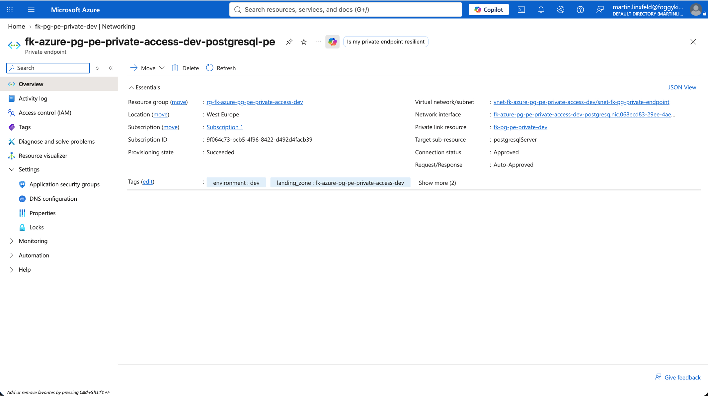

**Figure 6.** Private Endpoint connected to the PostgreSQL Flexible Server.

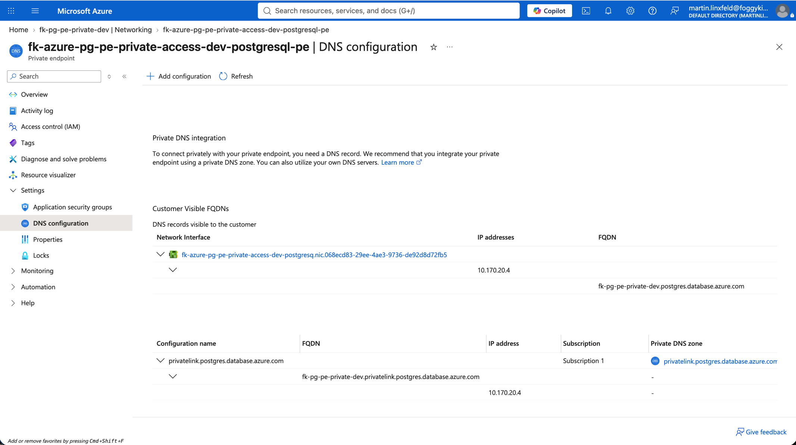

**Figure 7.** Private Endpoint DNS configuration for PostgreSQL Flexible Server.

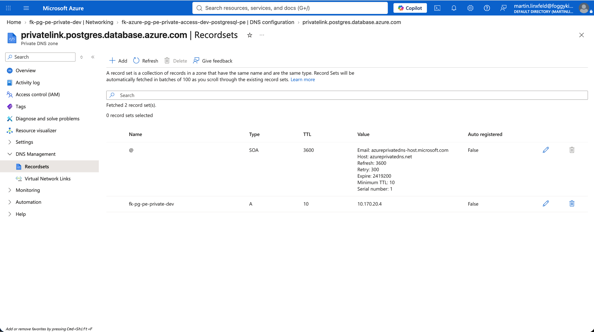

**Figure 8.** Private DNS Zone records for the PostgreSQL Private Endpoint.

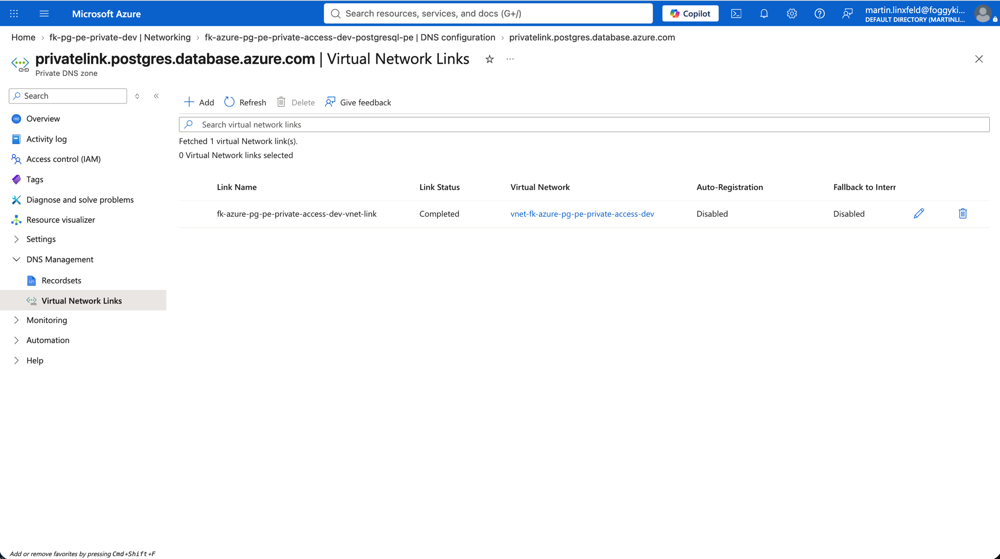

**Figure 9.** Private DNS Zone VNet link for private PostgreSQL name resolution.

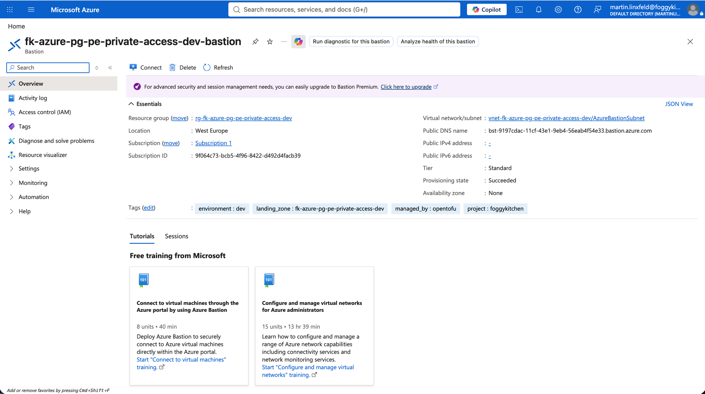

**Figure 10.** Azure Bastion used for operator access to the private validation host.

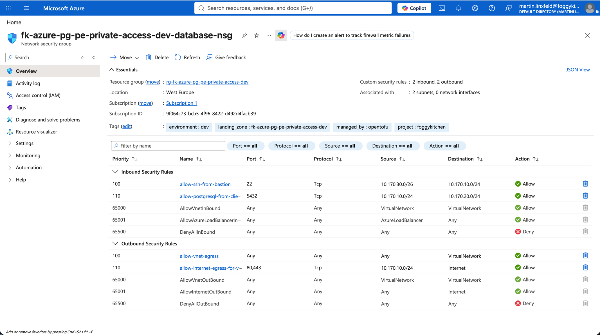

**Figure 11.** NSG rules for Bastion SSH and PostgreSQL reachability.

## Destroy

```bash
tofu destroy
```

## Notes

- `postgresql_admin_password` and `admin_ssh_public_key` are sensitive Terraform variables and are injected into `landing-zone.yaml` with `templatefile`.
- This Private Endpoint variant does not configure Microsoft Entra authentication, customer-managed keys, or Azure Monitor diagnostics.
- The PostgreSQL Flexible Server Private Endpoint target subresource is `postgresqlServer`.
- The Private DNS Zone used by this variant is `privatelink.postgres.database.azure.com`.
- Richer app-to-data topologies, cross-region replicas, disaster recovery, schema bootstrap, and governance belong in later PRs or the private blueprint layer.
- `terraform-az-fk-compute v0.3.5` deploys the validation host with a private NIC. Azure Bastion provides the operator access path.

## License

Licensed under the **Universal Permissive License (UPL), Version 1.0**.
See [LICENSE](../../../../../../LICENSE) for details.

© 2026 [FoggyKitchen.com](https://foggykitchen.com) - Cloud. Code. Clarity.
