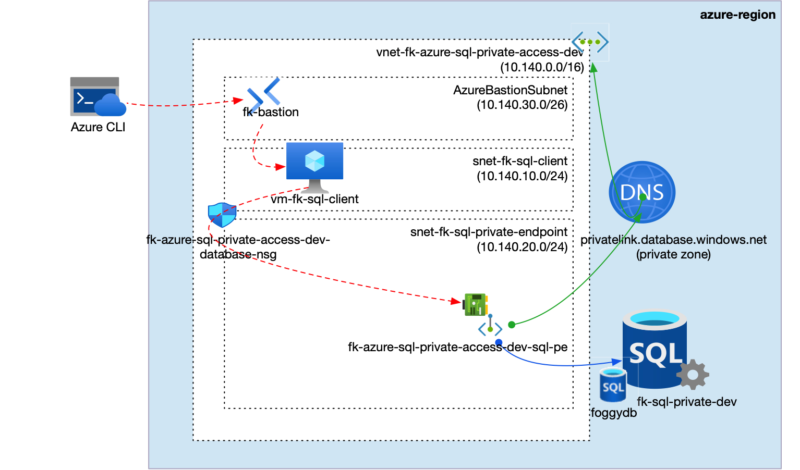
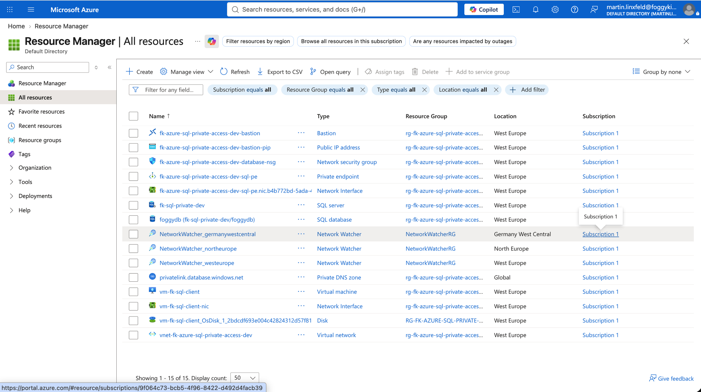
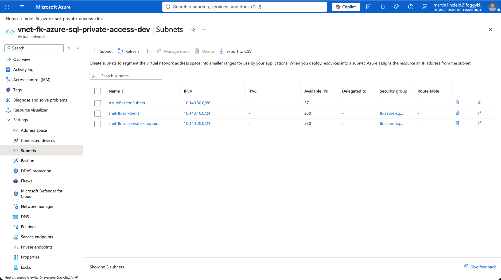
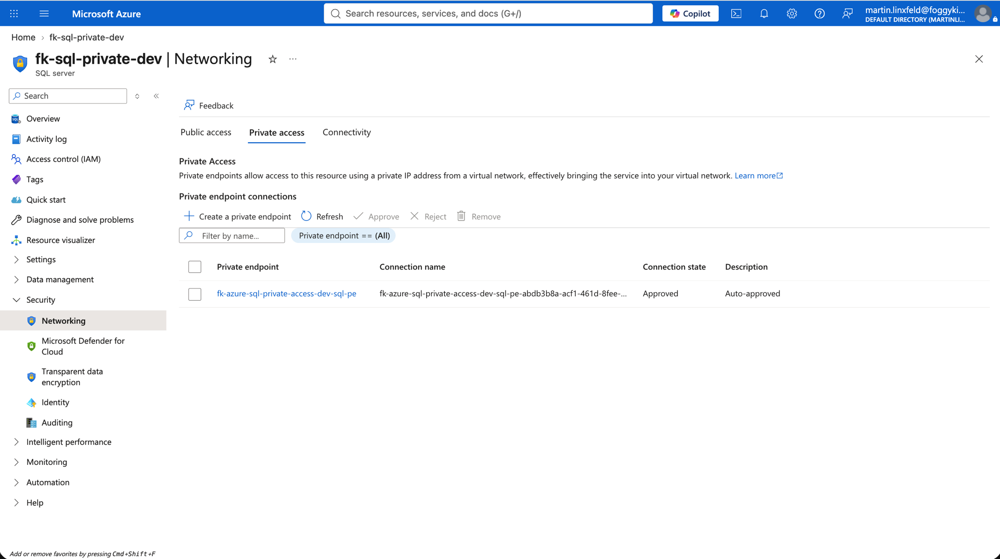
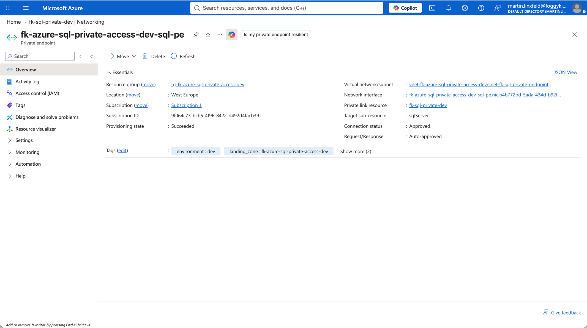
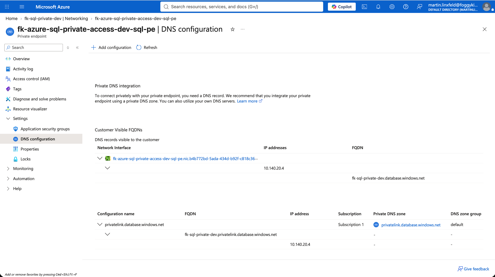
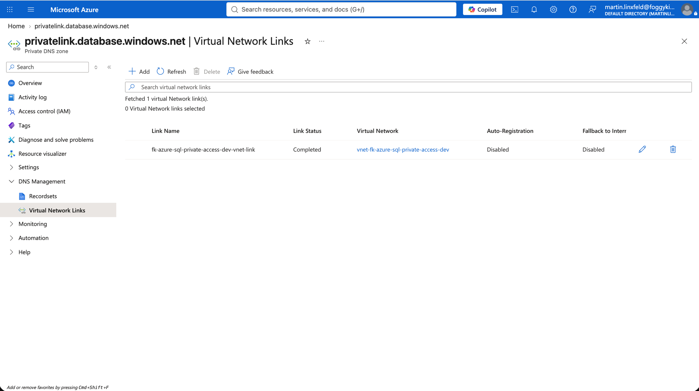
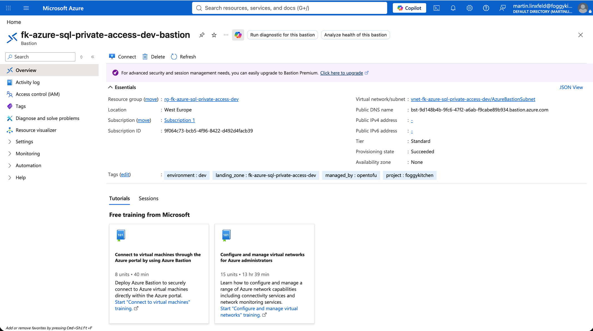
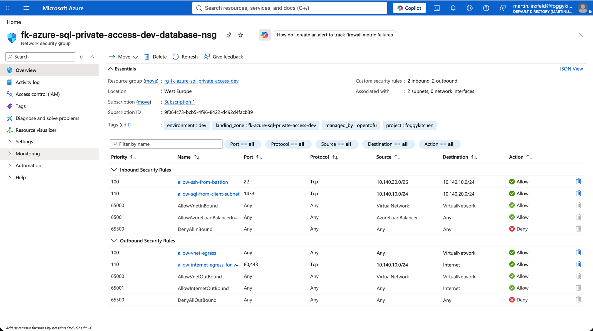

# Azure SQL Private Access - Private Endpoint Example

This example composes **Azure SQL Database** with Private Endpoint access, Azure Bastion operator access, and a small private validation host in the same VNet.

It is reshaped into a reusable `foggykitchen-landing-zone-orchestrator` pattern and payload from the current `terraform-az-fk-sql` Private Endpoint example.

## Architecture Overview



**Figure 1.** `sql_private_access` composes one VNet with a private validation host subnet, `AzureBastionSubnet`, one Private Endpoint subnet, one subnet-associated NSG, Azure SQL Database, Private DNS, Private Endpoint, and Azure Bastion access for private reachability validation.

The `sql_private_access` pattern composes one VNet with a validation host subnet, `AzureBastionSubnet`, one Private Endpoint subnet, one subnet-associated NSG, one Azure Bastion host, one Private DNS Zone linked to the VNet, one Azure SQL logical server with public network access disabled, one SQL database, and one Private Endpoint using subresource `sqlServer`.

## What This Example Deploys

- one Resource Group
- one VNet
- one client subnet
- one `AzureBastionSubnet`
- one Private Endpoint subnet
- one NSG associated to the client and Private Endpoint subnets
- one Azure Bastion host for SSH access to the private validation host
- one Private DNS Zone linked to the VNet
- one Azure SQL logical server with public network access disabled
- one Azure SQL database
- one Private Endpoint for Azure SQL using subresource `sqlServer`
- one lightweight compute host used to validate private TCP `1433` reachability

## Pattern

- [`patterns/azure/sql_private_access`](../../../../../../patterns/azure/sql_private_access/README.md)

## Files

- [landing-zone.yaml](landing-zone.yaml)
- [main.tf](main.tf)
- [providers.tf](providers.tf)
- [variables.tf](variables.tf)
- [outputs.tf](outputs.tf)
- [terraform.tfvars.example](terraform.tfvars.example)

## Deploy

```bash
cp terraform.tfvars.example terraform.tfvars
tofu init
tofu plan
tofu apply
```

Replace the placeholder values in `terraform.tfvars` before planning.

## Validation Flow

After apply, use the `validation_host.ssh_command` output to connect to the private validation host through Azure Bastion, then validate Azure SQL reachability:

```bash
az network bastion ssh --name <bastion-name> --resource-group <resource-group-name> --target-resource-id <validation-vm-id> --auth-type ssh-key --username azureuser --ssh-key <path-to-private-key>
nc -vz <azure-sql-logical-server-fqdn> 1433
```

Expected result:

- TCP port `1433` is reachable from the validation host
- Azure SQL resolves through the VNet-linked Private DNS Zone
- the validation host has no public IP and operator SSH goes through Azure Bastion
- public network access on the Azure SQL logical server remains disabled
- no Azure SQL firewall rules are created

## Validation Result

Validation output from the deployed example through Azure Bastion:

```text
== client host ==
vm-fk-sql-client

== client addresses ==
10.140.10.4

== sql dns ==
10.140.20.4     fk-sql-private-dev.privatelink.database.windows.net fk-sql-private-dev.database.windows.net

== sql tcp 1433 ==
Connection to fk-sql-private-dev.database.windows.net (10.140.20.4) 1433 port [tcp/ms-sql-s] succeeded!
```

## Azure Portal Verification



**Figure 2.** Resource Group overview after deployment.



**Figure 3.** VNet subnets for client, Bastion, and Private Endpoint access.



**Figure 4.** Azure SQL networking with public access disabled.



**Figure 5.** Private Endpoint connected to the Azure SQL logical server with subresource `sqlServer`.



**Figure 6.** Private Endpoint DNS integration with `privatelink.database.windows.net`.



**Figure 7.** Private DNS Zone `privatelink.database.windows.net` linked to the VNet.



**Figure 8.** Azure Bastion used for operator access to the private validation host.



**Figure 9.** NSG rules for Bastion SSH and Azure SQL reachability.

## Destroy

```bash
tofu destroy
```

## Notes

- `sql_admin_password` and `admin_ssh_public_key` are sensitive Terraform variables and are injected into `landing-zone.yaml` with `templatefile`.
- This Private Endpoint variant does not configure Microsoft Entra administrator, TDE customer-managed keys, or Azure Monitor diagnostics.
- Secure variants, richer app-to-data topologies, cross-region disaster recovery, schema bootstrap, and governance belong in later PRs or the private blueprint layer.
- `terraform-az-fk-compute v0.3.5` deploys the validation host with a private NIC. Azure Bastion provides the operator access path.

## License

Licensed under the **Universal Permissive License (UPL), Version 1.0**.
See [LICENSE](../../../../../../LICENSE) for details.

© 2026 [FoggyKitchen.com](https://foggykitchen.com) - Cloud. Code. Clarity.
