# Azure Bulk Ingestion Pipeline Basic Example

This example is a thin wrapper around the shared **bulk_ingestion_pipeline** pattern.

It demonstrates:

- a Linux Function App with `fnbulkload`, `fncollector`, and validation-only `fnvalidator`
- a private Blob Storage ingestion container
- Event Grid routing Blob Created events to `fnbulkload`
- asynchronous handoff through Event Hubs
- native Event Hub trigger delivery into `fncollector`
- persistence into PostgreSQL Flexible Server over delegated-subnet private access
- API Management exposing validation-only `GET /validate` to prove rows landed in PostgreSQL

## Architecture Overview

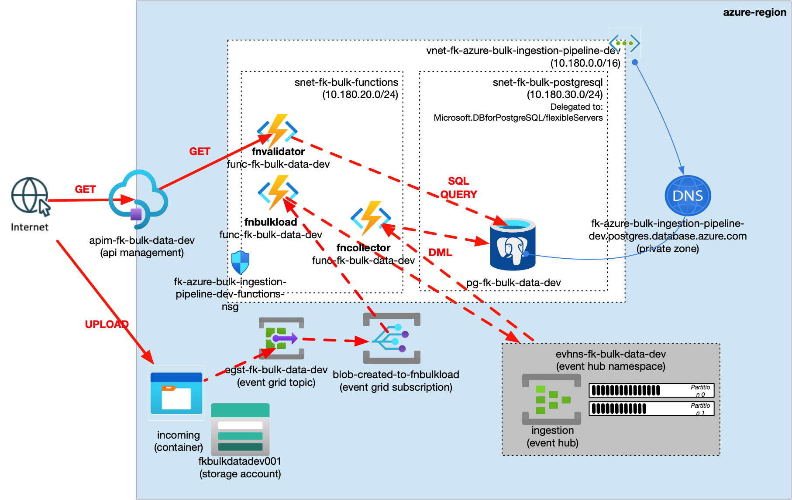

**Figure 1.** `bulk_ingestion_pipeline` runtime flow: Blob Created events invoke `fnbulkload` through Event Grid, `fnbulkload` reads the uploaded blob and publishes records into Event Hubs, `fncollector` consumes through a native Azure Functions trigger, and the collector persists final records in PostgreSQL Flexible Server over private delegated-subnet access. The validation-only `fnvalidator` endpoint is exposed through API Management as `GET /validate` and queries PostgreSQL to prove that the pipeline wrote the expected row.

## Files

- `landing-zone.yaml`: payload describing the Azure bulk ingestion pipeline pattern
- `main.tf`: thin wrapper around the shared pattern
- `providers.tf`: Azure provider configuration
- `variables.tf`: provider and secret inputs
- `outputs.tf`: useful outputs
- `terraform.tfvars.example`: example provider values
- `functions/`: bulk loader, collector, and validator function source
- `diagrams/`: architecture and validation screenshots

## Usage

```bash
cp terraform.tfvars.example terraform.tfvars
tofu init
tofu validate
```

Do not run `tofu plan` or `tofu apply` unless you intend to deploy real Azure resources.

## Validation Flow

After apply, validate the pattern by:

1. uploading a JSON object or array into the `incoming` Blob container
2. confirming that Event Grid invokes `fnbulkload`
3. confirming that Event Hubs receives records from `fnbulkload`
4. confirming that `fncollector` consumes Event Hub messages
5. querying the API Management `fnvalidator` endpoint to prove that PostgreSQL contains the expected row

Example blob payload:

```json
{
  "validation_id": "fk-bulk-validation-20261001-105531",
  "device": "sensor-blob-validator",
  "temperature": 22.4
}
```

Example validation command:

```bash
curl -sS -i \
  "https://apim-fk-bulk-data-dev.azure-api.net/v1/validate?validation_id=fk-bulk-validation-20261001-105531"
```

The `fnvalidator` function is included for example validation only. It is not part of the production ingestion path and should be replaced by operationally appropriate observability or authenticated data access in a secure variant.

## Validation Result

Validation output from the deployed example:

```text
Upload blob to fkbulkdatadev001/incoming
Blob name: fk-bulk-validation-20261001-105531.json
HTTP status: upload succeeded

GET /v1/validate?validation_id=fk-bulk-validation-20261001-105531
HTTP/1.1 200 OK
{
  "validation_id": "fk-bulk-validation-20261001-105531",
  "count": 1,
  "source": "blob",
  "device": "sensor-blob-validator",
  "matched_validation_id": "fk-bulk-validation-20261001-105531",
  "last_created_at": "2026-10-01 10:55:36.513554+00"
}
```

The first upload attempt with Azure AD data-plane authentication failed because the operator identity did not have a Storage Blob Data Contributor/Owner role. The validation upload used Storage Account key authentication for the operator-side test only; the runtime pipeline itself uses managed identity and RBAC.

## Azure Portal Verification

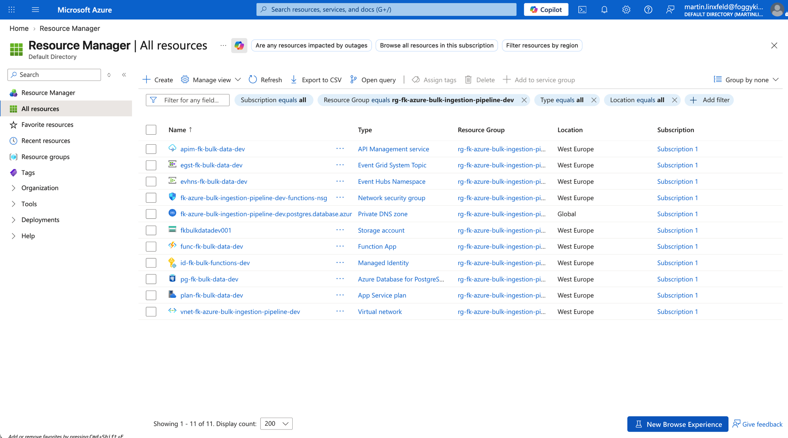

**Figure 2.** Resource Group overview after deployment.

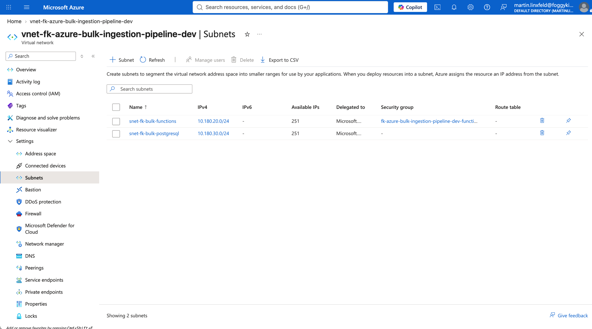

**Figure 3.** VNet subnets for the Function App integration subnet and PostgreSQL delegated subnet.

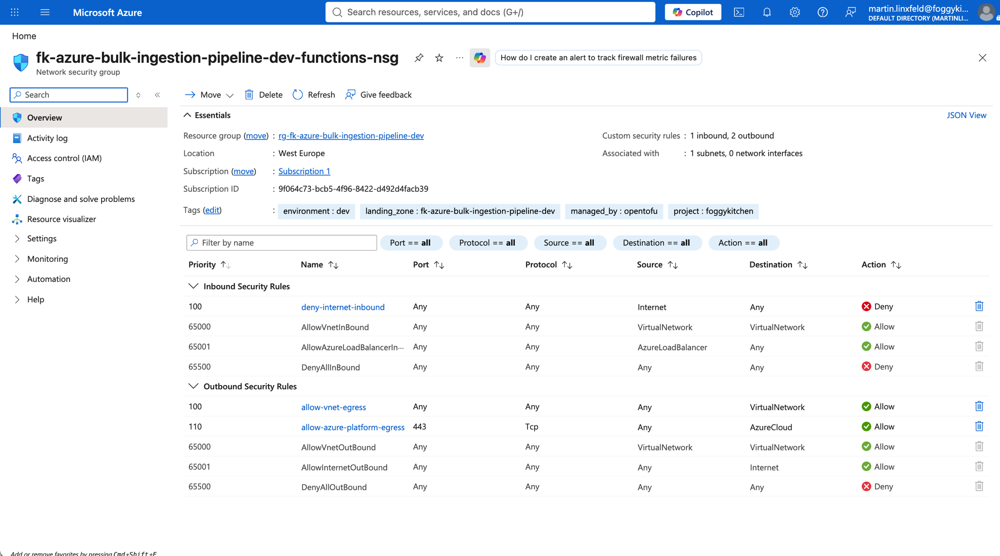

**Figure 4.** NSG associated with the Functions integration subnet.

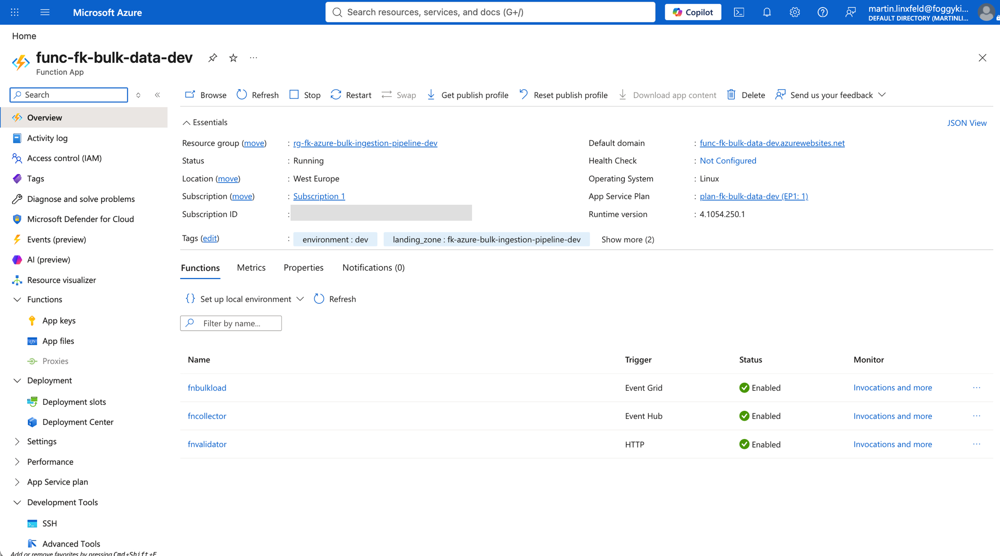

**Figure 5.** Function App overview showing `fnbulkload`, `fncollector`, and validation-only `fnvalidator`.

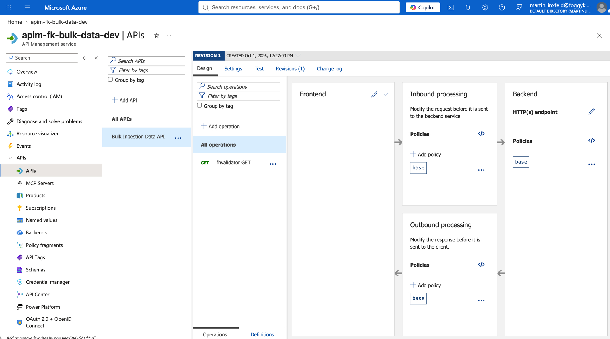

**Figure 6.** API Management operation for validation-only `GET /validate`.

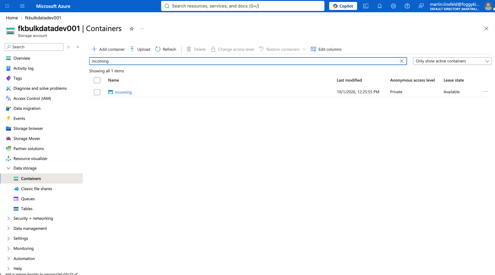

**Figure 7.** Private Blob Storage ingestion container `incoming`.

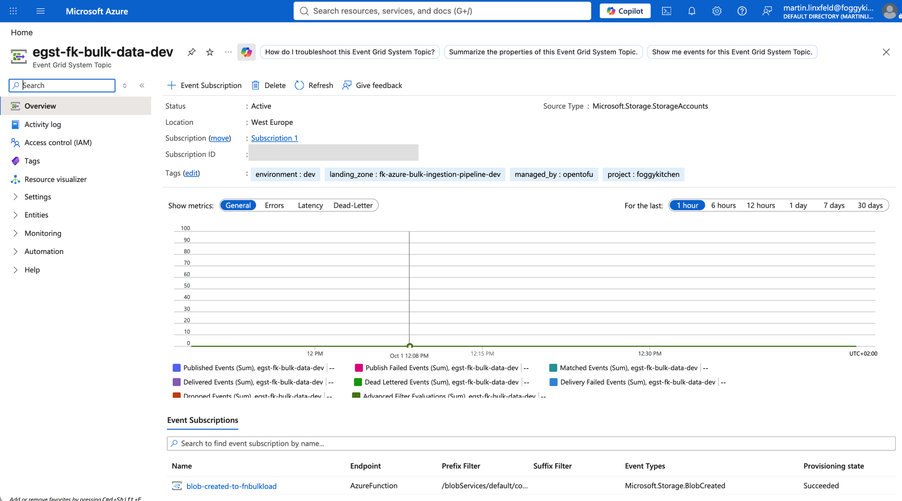

**Figure 8.** Event Grid System Topic and `blob-created-to-fnbulkload` subscription.

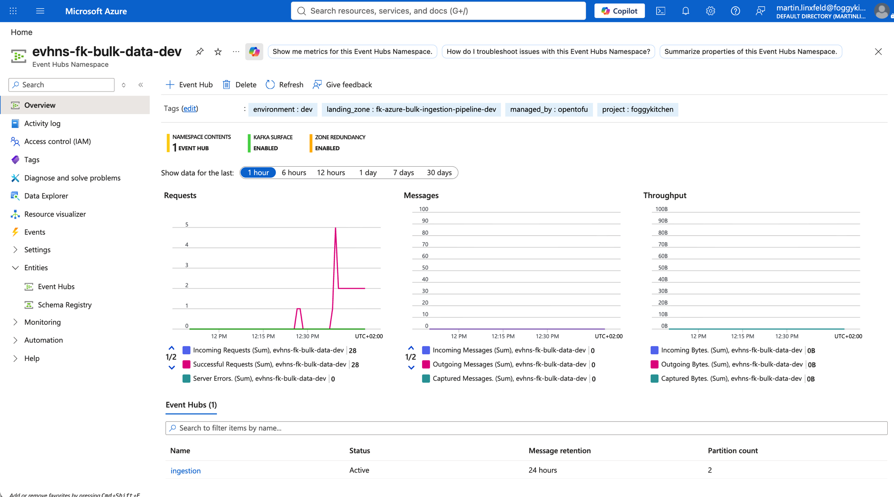

**Figure 9.** Event Hubs namespace with the `ingestion` Event Hub used as the asynchronous buffer.

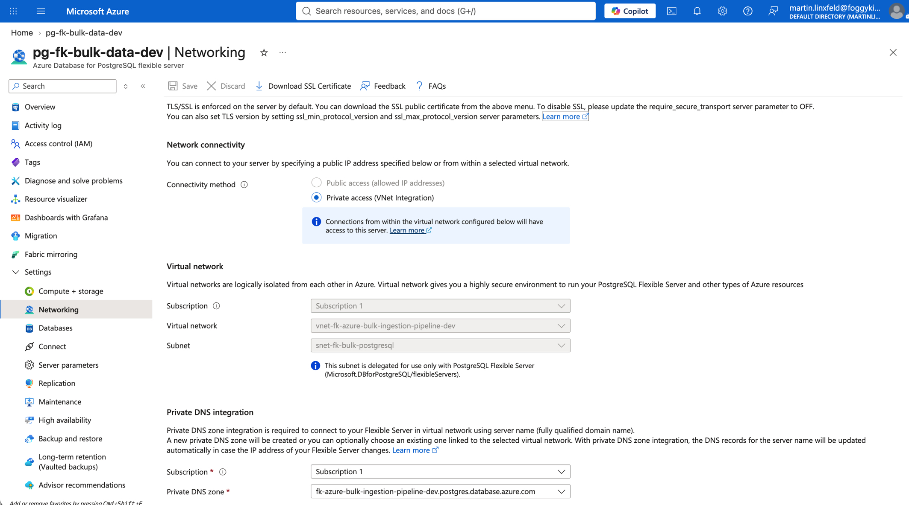

**Figure 10.** PostgreSQL Flexible Server networking with delegated-subnet private access and public access disabled.

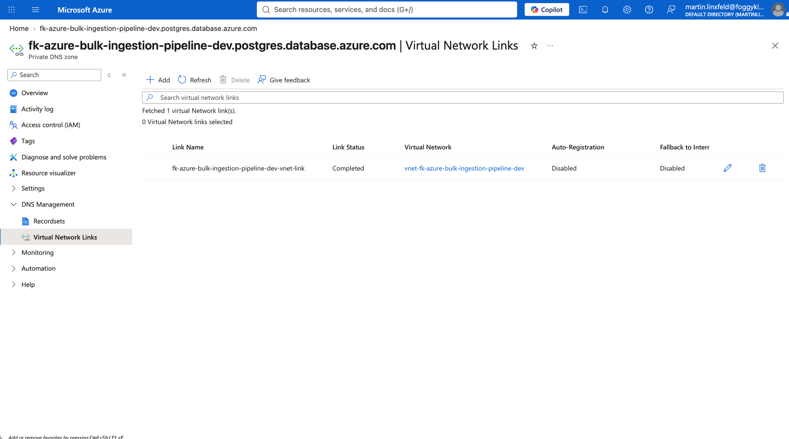

**Figure 11.** PostgreSQL private DNS zone linked to the pipeline VNet.

## Notes

- this Azure pattern mirrors the OCI `bulk_ingestion_pipeline` shape, but uses Azure-native bindings instead of Service Connector Hub
- `fninitiator` belongs in the separate Azure `event_driven_data_pipeline` pattern; this pattern exposes only validation-only API Management access
- API Management policy XML is generated by `terraform-az-fk-api-management` from the `routes` input
- the current Function module packages the named functions into one Function App ZIP
- PostgreSQL uses password-based connectivity because this basic delegated-subnet variant does not enable PostgreSQL Entra authentication
- richer private ingress hardening belongs in a later secure/private blueprint layer

## License

Licensed under the **Universal Permissive License (UPL), Version 1.0**.  
See [LICENSE](../../../../../LICENSE) for details.

© 2026 [FoggyKitchen.com](https://foggykitchen.com) - Cloud. Code. Clarity.
