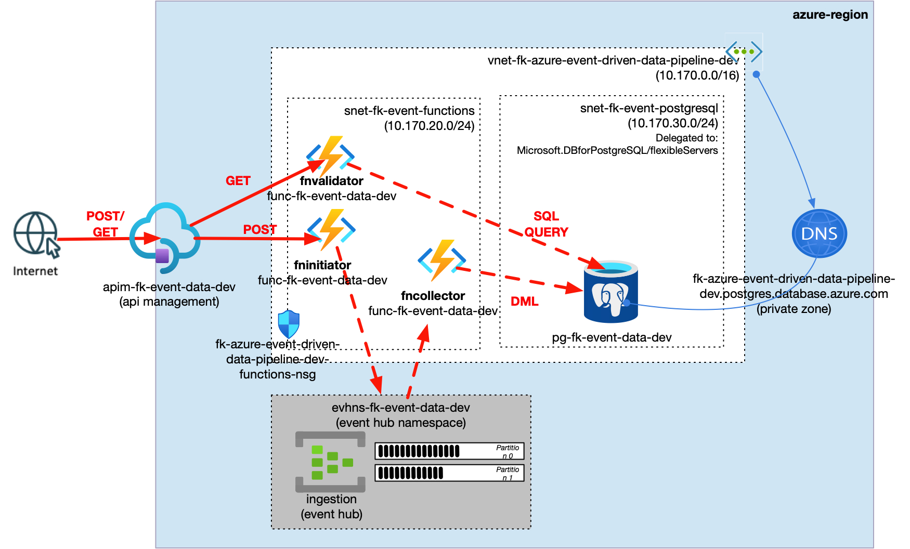
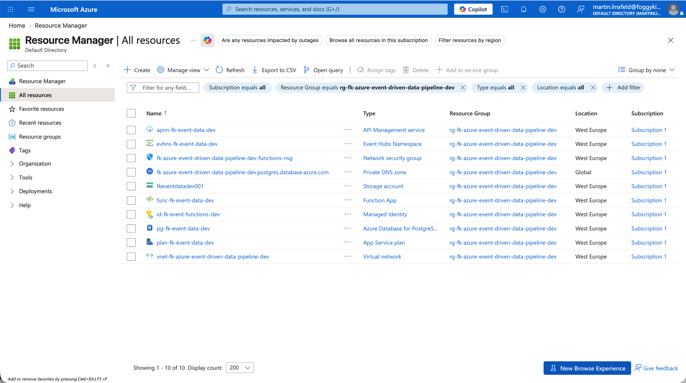
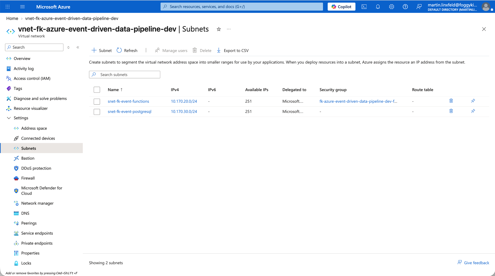
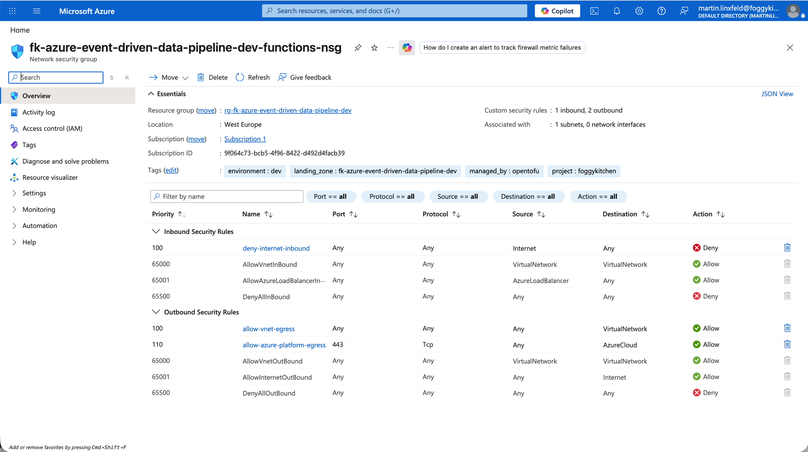
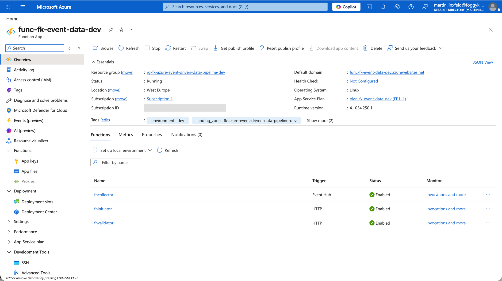
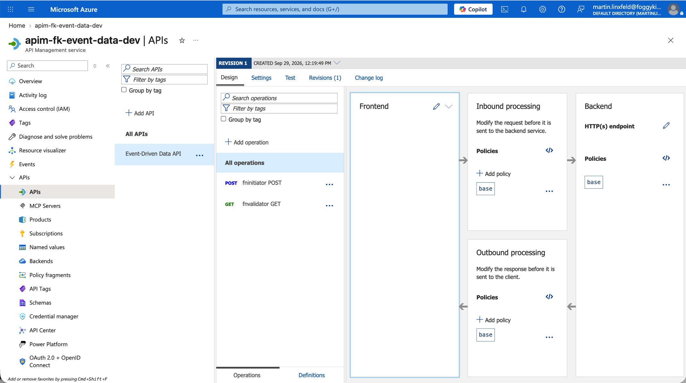
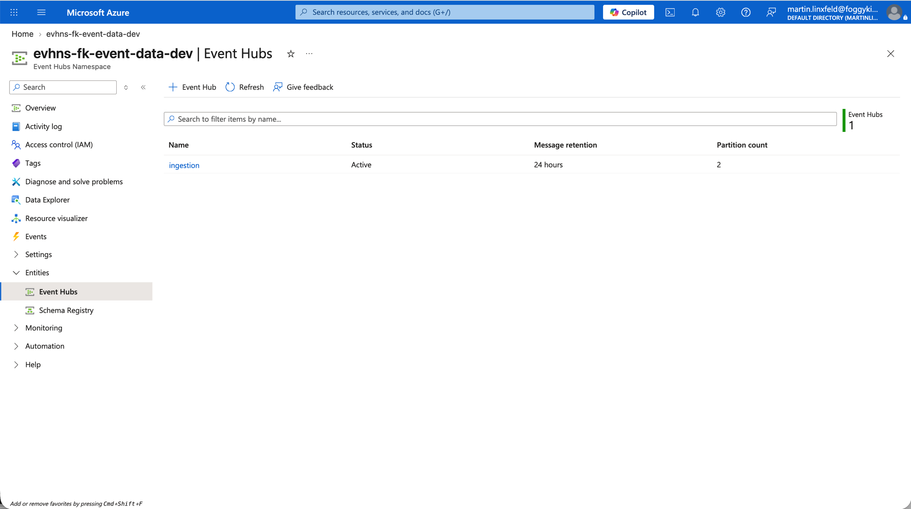
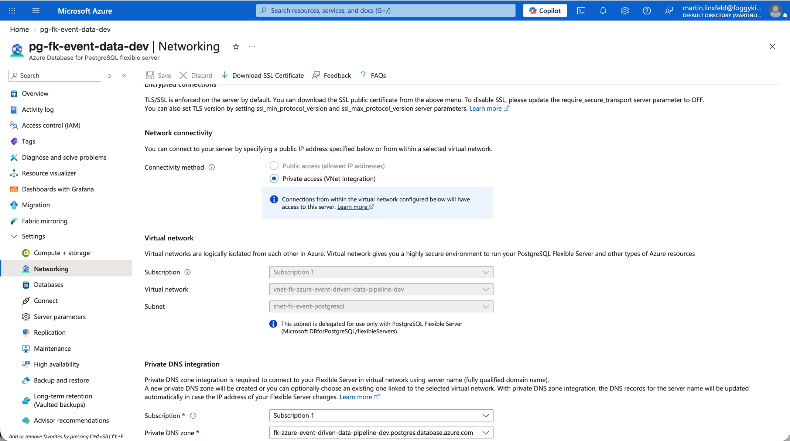
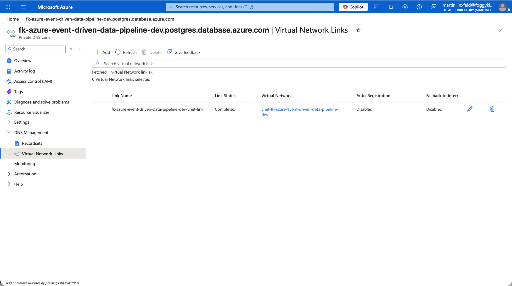

# Azure Event-Driven Data Pipeline Basic Example

This example is a thin wrapper around the shared **event_driven_data_pipeline** pattern.

It demonstrates:

- a Linux Function App with `fninitiator`, `fncollector`, and validation-only `fnvalidator`
- API Management routing public HTTP entry points to `fninitiator` and `fnvalidator`
- asynchronous handoff through Event Hubs
- native Event Hub trigger delivery into `fncollector`
- persistence into PostgreSQL Flexible Server over delegated-subnet private access

## Architecture Overview



**Figure 1.** `event_driven_data_pipeline` runtime flow: API Management invokes `fninitiator`, the initiator publishes records into Event Hubs, `fncollector` consumes through a native Azure Functions trigger, and the collector persists final records in PostgreSQL Flexible Server over private delegated-subnet access. The validation-only `fnvalidator` endpoint is exposed through API Management as `GET /validate` and queries PostgreSQL to prove that the pipeline wrote the expected row.

## Files

- `landing-zone.yaml`: payload describing the Azure event-driven data pipeline pattern
- `main.tf`: thin wrapper around the shared pattern
- `providers.tf`: Azure provider configuration
- `variables.tf`: provider and secret inputs
- `outputs.tf`: useful outputs
- `terraform.tfvars.example`: example provider values
- `functions/`: initiator, collector, and validator function source
- `diagrams/`: architecture and validation screenshots

## Usage

```bash
cp terraform.tfvars.example terraform.tfvars
tofu init
tofu validate
```

Do not run `tofu plan` or `tofu apply` unless you intend to deploy real Azure resources.

## Validation Flow

After apply, validate the pattern by:

1. posting a JSON object or array to the API Management `fninitiator` endpoint
2. confirming that Event Hubs receives records from `fninitiator`
3. confirming that `fncollector` consumes Event Hub messages
4. querying the API Management `fnvalidator` endpoint to prove that PostgreSQL contains the expected row

Example API payload:

```json
{
  "validation_id": "fk-event-validation-20260929-133901",
  "device": "sensor-apim-validator",
  "temperature": 21.7
}
```

Example validation commands:

```bash
curl -sS -i -X POST \
  "https://apim-fk-event-data-dev.azure-api.net/v1/ingest" \
  -H "Content-Type: application/json" \
  -d '{"validation_id":"fk-event-validation-20260929-133901","device":"sensor-apim-validator","temperature":21.7}'

curl -sS -i \
  "https://apim-fk-event-data-dev.azure-api.net/v1/validate?validation_id=fk-event-validation-20260929-133901"
```

## Validation Result

Validation output from the deployed example through API Management:

```text
POST /v1/ingest
HTTP/1.1 202 Accepted
{"accepted": 1}

GET /v1/validate?validation_id=fk-event-validation-20260929-133901
HTTP/1.1 200 OK
{
  "validation_id": "fk-event-validation-20260929-133901",
  "count": 1,
  "source": "api",
  "device": "sensor-apim-validator",
  "matched_validation_id": "fk-event-validation-20260929-133901",
  "last_created_at": "2026-09-29 13:39:02.784083+00"
}
```

The `fnvalidator` function is included for example validation only. It is not part of the production ingestion path and should be replaced by operationally appropriate observability or authenticated data access in a secure variant.

## Azure Portal Verification



**Figure 2.** Resource Group overview after deployment.



**Figure 3.** VNet subnets for the Function App integration subnet and PostgreSQL delegated subnet.



**Figure 4.** NSG associated with the Functions integration subnet.



**Figure 5.** Function App overview for the deployed event-driven data pipeline runtime.



**Figure 6.** API Management operations for `POST /ingest` and validation-only `GET /validate`.



**Figure 7.** Event Hubs namespace with the `ingestion` Event Hub used as the asynchronous buffer.



**Figure 8.** PostgreSQL Flexible Server networking with delegated-subnet private access and public access disabled.



**Figure 9.** PostgreSQL private DNS zone linked to the pipeline VNet.

## Notes

- this Azure pattern mirrors the OCI `event_driven_data_pipeline` shape, but uses Azure-native bindings instead of Service Connector Hub
- Blob Storage, Event Grid, and `fnbulkload` belong in the sibling Azure `bulk_ingestion_pipeline` pattern
- API Management policy XML is generated by `terraform-az-fk-api-management` from the `routes` input
- the current Function module packages the named functions into one Function App ZIP
- PostgreSQL uses password-based connectivity because this basic delegated-subnet variant does not enable PostgreSQL Entra authentication
- the intended public entry point is API Management; richer private ingress hardening belongs in a later secure/private blueprint layer

## License

Licensed under the **Universal Permissive License (UPL), Version 1.0**.  
See [LICENSE](../../../../../LICENSE) for details.

© 2026 [FoggyKitchen.com](https://foggykitchen.com) - Cloud. Code. Clarity.
