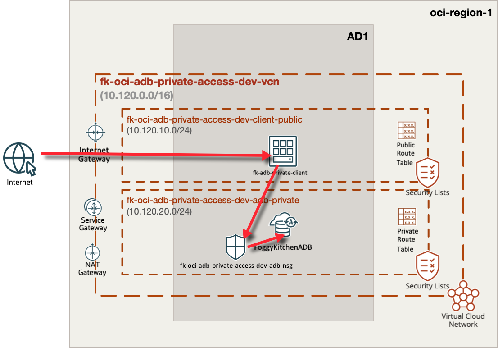
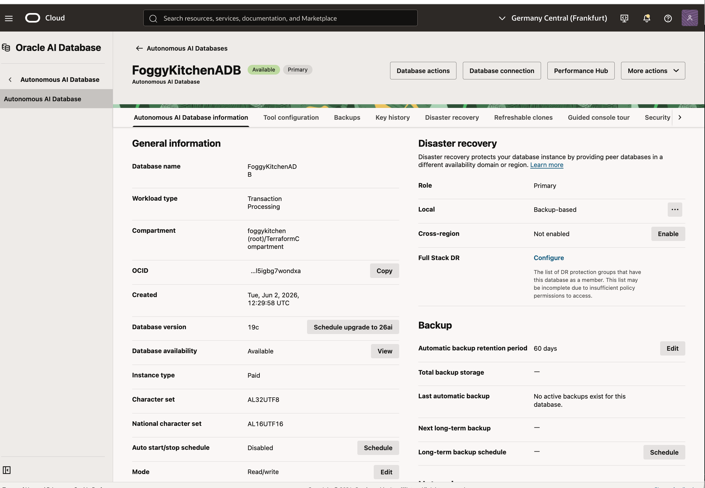
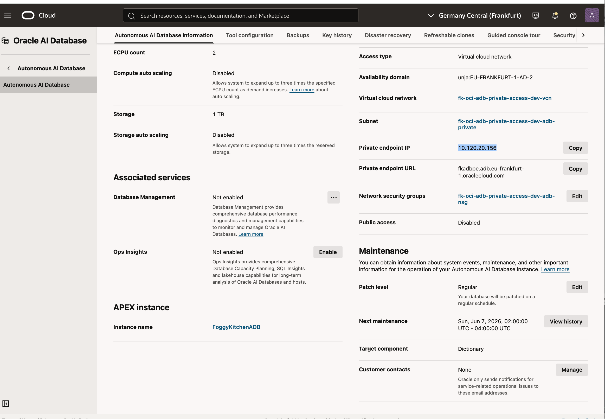
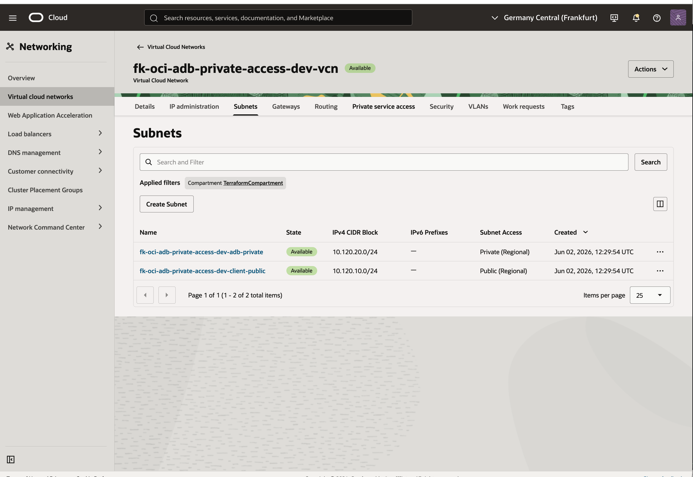
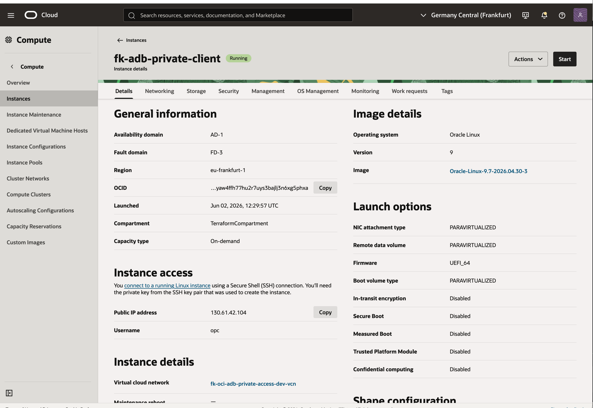
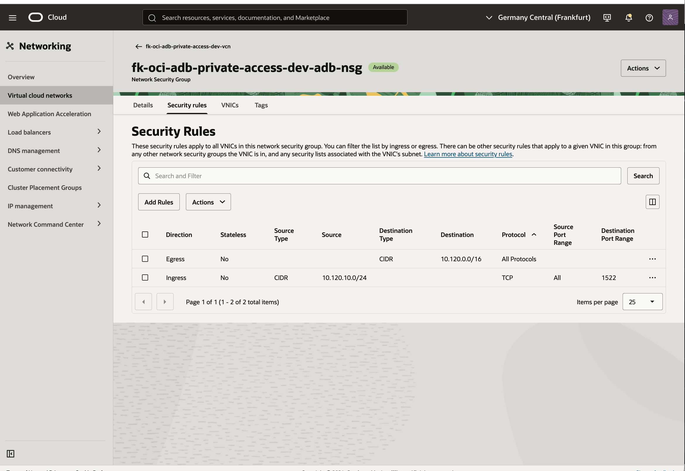

# OCI ADB Private Access - Basic Example

This example composes a **private Autonomous Database Serverless endpoint** with a **small public validation host** in the same VCN.

It is inspired by:

- `terraform-oci-fk-adb/training/lesson3_adb_with_private_endpoint`

but reshaped into a reusable `foggykitchen-landing-zone-orchestrator` pattern and payload.

## Architecture Overview



**Figure 1.** `adb_private_access` composes one VCN with a public validation host subnet, one private ADB subnet, an NSG-protected ADB private endpoint, and the OCI gateway path required for private database reachability and package access.

## What This Example Deploys

- one VCN
- one public client subnet
- one private ADB subnet
- one NSG attached to the ADB private endpoint
- one Autonomous Database Serverless deployment with a private endpoint
- one lightweight public compute instance used to validate private SQL*Net reachability

## Pattern

- [`patterns/oci/adb_private_access`](../../../../../../patterns/oci/adb_private_access/README.md)

## Files

- [landing-zone.yaml](landing-zone.yaml)
- [main.tf](main.tf)
- [providers.tf](providers.tf)
- [variables.tf](variables.tf)
- [outputs.tf](outputs.tf)

## Deploy

```bash
tofu init
tofu plan
tofu apply
```

## Validation Flow

After apply:

1. Connect to the validation host:

```bash
ssh opc@<validation-host-public-ip>
```

2. Validate private SQL*Net reachability to the ADB private endpoint:

```bash
nc -vz <adb-private-endpoint-ip> 1522
```

Expected result:

- TCP port `1522` is reachable from the validation host
- the ADB private endpoint remains inaccessible directly from the public internet

If `admin_ssh_public_key` is left empty, the example generates a temporary SSH key pair and exposes the private key as:

- `generated_admin_ssh_private_key_pem`

## Validation Result

The example was validated end-to-end with:

- validation host public IP: `130.61.42.104`
- ADB private endpoint IP: `10.120.20.156`

Observed connectivity check:

```bash
ssh -i /tmp/fk-adb-private/id_rsa opc@130.61.42.104
hostname
nc -vz 10.120.20.156 1522
```

Observed result:

```text
fk-adb-private-client-primary-vnic
Ncat: Connected to 10.120.20.156:1522.
```

## OCI Console Verification



**Figure 2.** `FoggyKitchenADB` is provisioned and available as an Autonomous Database Serverless deployment.



**Figure 3.** The database is deployed with `Virtual cloud network` access, private endpoint IP `10.120.20.156`, and NSG `fk-oci-adb-private-access-dev-adb-nsg` attached to the ADB private endpoint.



**Figure 4.** The VCN contains both subnets used by the pattern: the public client subnet and the private ADB subnet.



**Figure 5.** The validation host `fk-adb-private-client` is running with a public IP for SSH-based reachability tests.



**Figure 6.** The ADB NSG allows TCP `1522` from the client subnet `10.120.10.0/24` and keeps the private endpoint constrained to VCN traffic.

## Destroy

```bash
tofu destroy
```

## Notes

- This public example validates **private network access**, not full schema bootstrap or data loading.
- The validation host can be customized with `workload.client.cloud_init_override`.
- The validation host currently relies on the public subnet security list rather than a dedicated VNIC NSG.
- `adb_wallet` is exposed as a **sensitive output** for downstream client tooling if needed.

## License

Licensed under the **Universal Permissive License (UPL), Version 1.0**.  
See [LICENSE](../../../../../../LICENSE) for details.

© 2026 [FoggyKitchen.com](https://foggykitchen.com) - Cloud. Code. Clarity.
