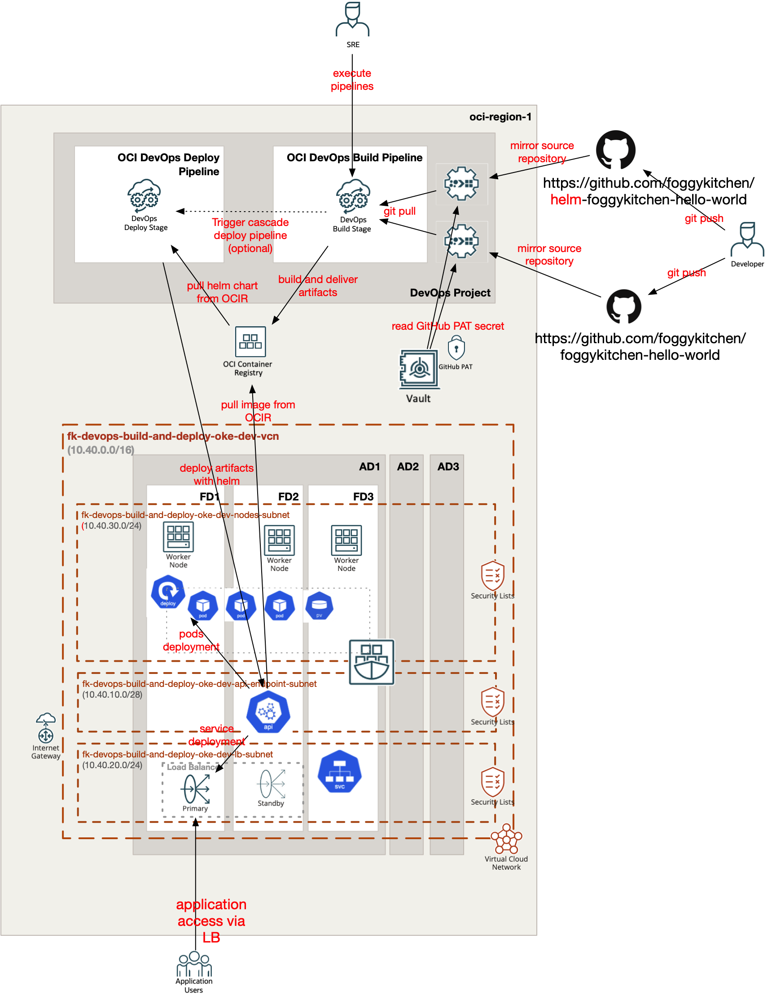
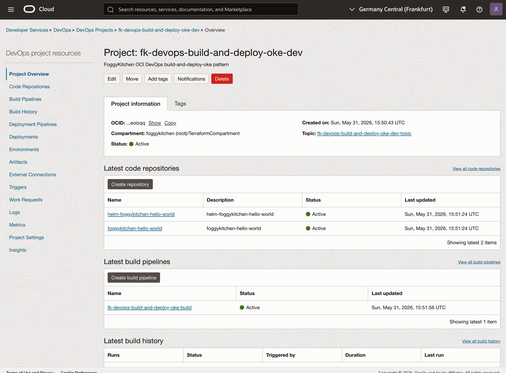
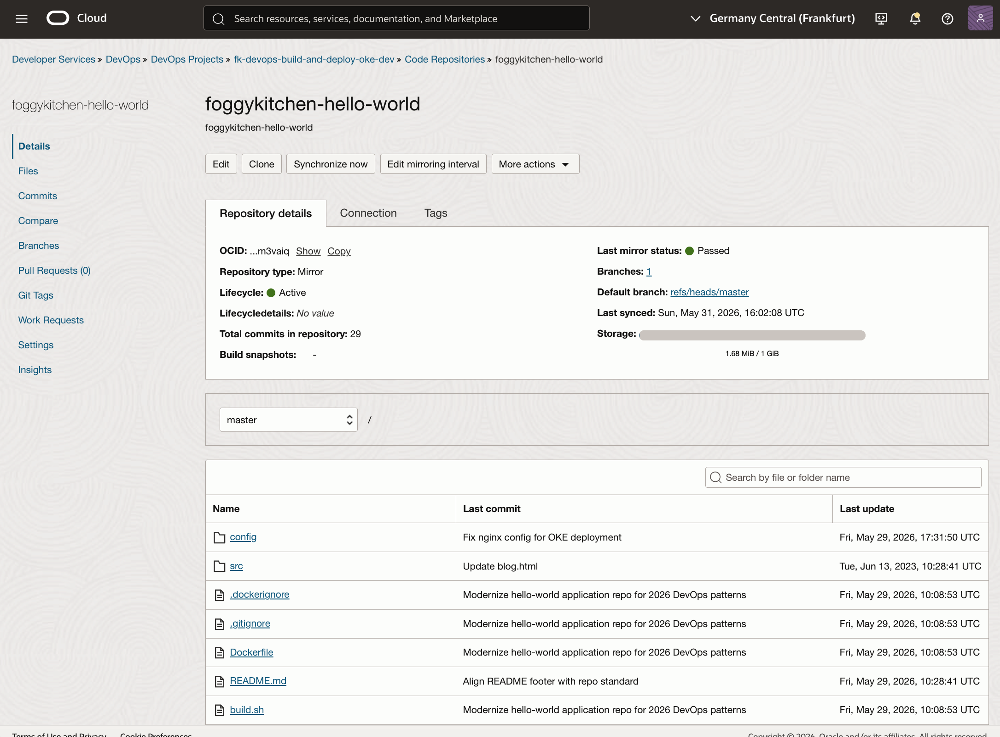
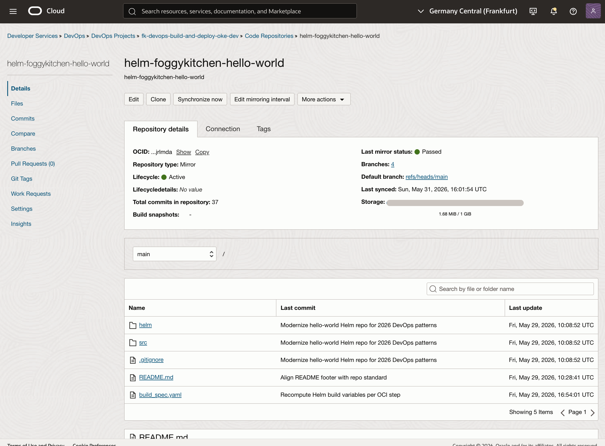
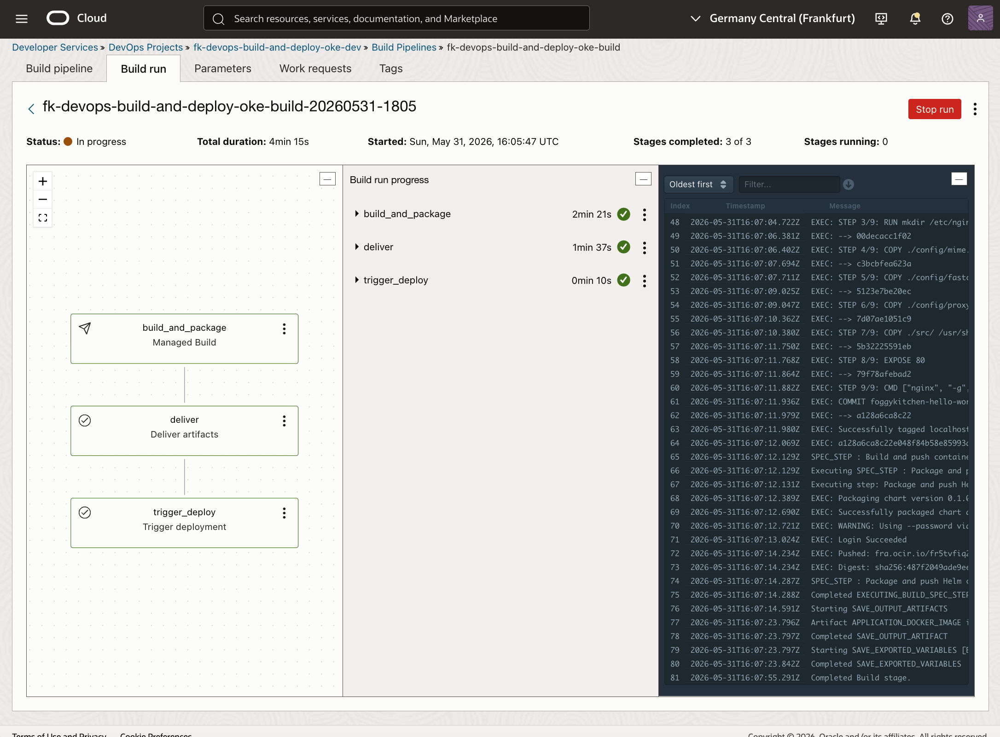
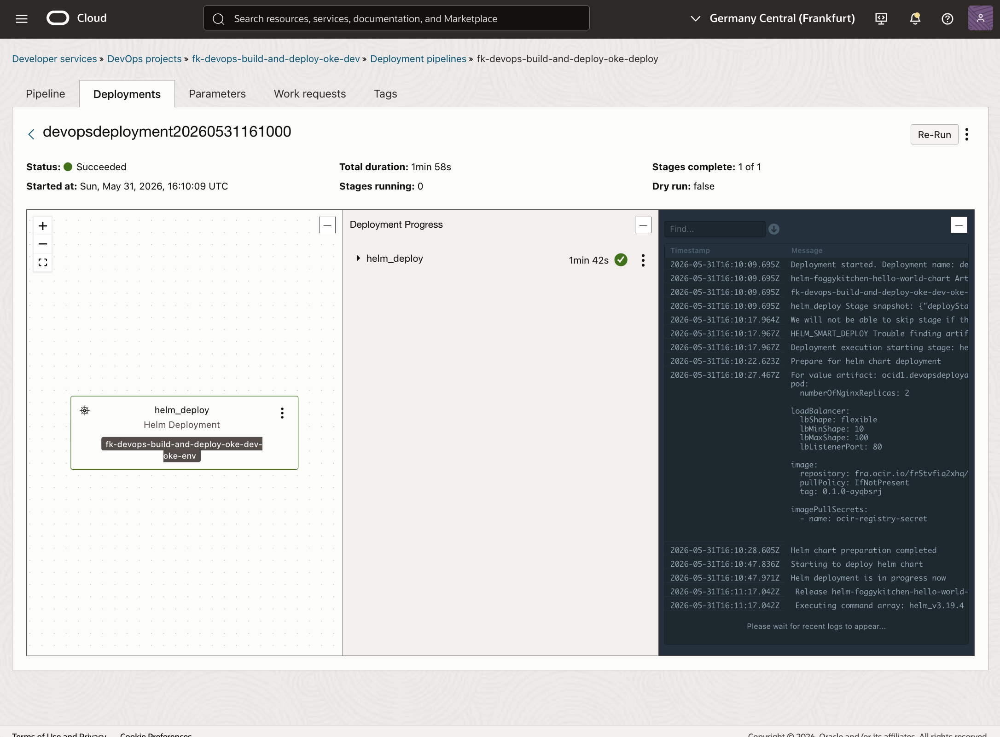
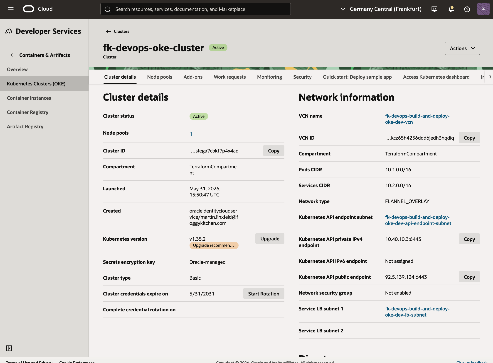
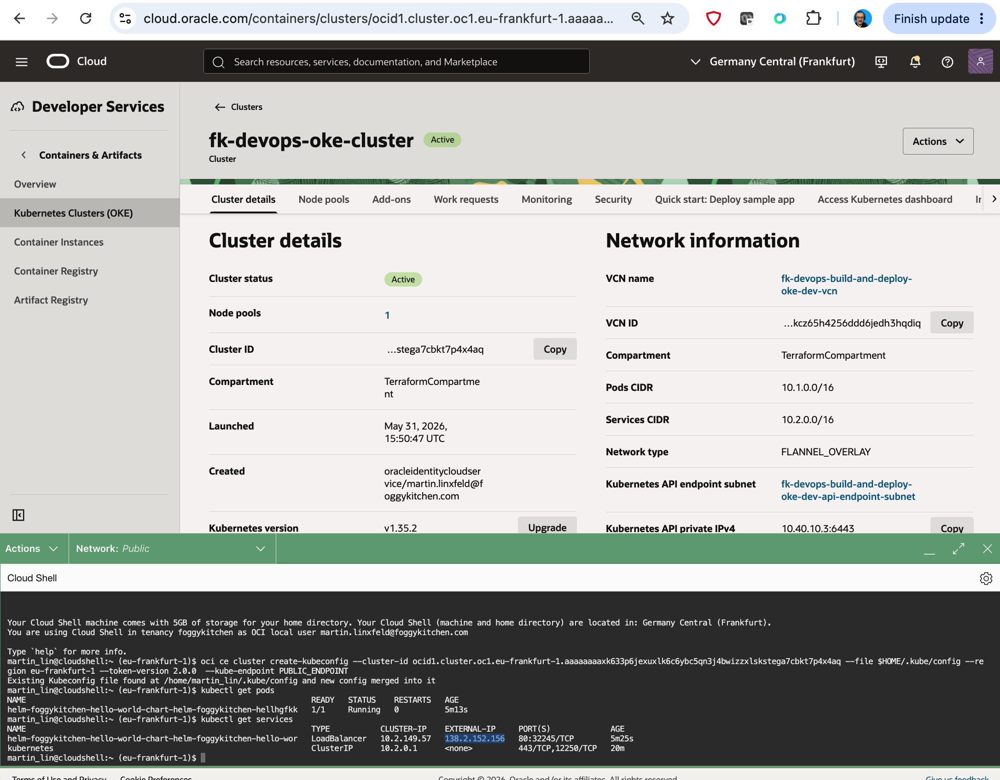
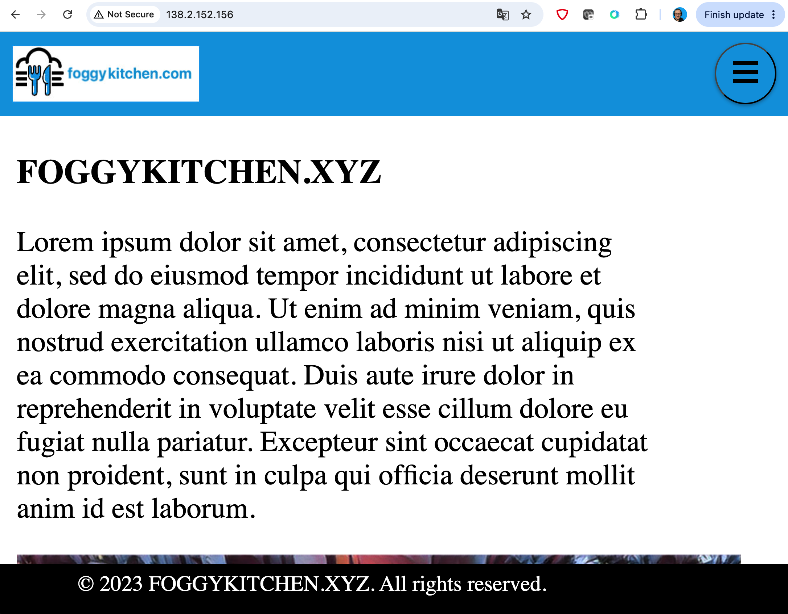

# OCI DevOps Build-And-Deploy-OKE Basic Example

This example is a thin wrapper around the shared **OCI DevOps build-and-deploy-oke** pattern.

It demonstrates a basic public CI/CD flow made of:

- one DevOps project
- one OKE cluster with supporting VCN and subnets
- two mirrored GitHub repositories
- two OCIR repositories for image and Helm artifacts
- one build pipeline that builds an image and packages a Helm chart
- one deploy pipeline that is ready to deploy the chart to OKE

## Architecture Overview



Figure 1. Reference architecture for the public `build-and-deploy-oke` pattern. The build pipeline mirrors the application and Helm repositories, builds and delivers artifacts to OCIR, and can optionally trigger the deploy pipeline. The deploy pipeline then pulls the Helm chart from OCIR and rolls the application out to OKE behind a public load balancer.

## Files

- `landing-zone.yaml`: payload describing the build-and-deploy-oke pattern
- `main.tf`: thin wrapper around the shared pattern
- `providers.tf`: OCI provider configuration
- `variables.tf`: provider and secret inputs
- `outputs.tf`: useful outputs
- `terraform.tfvars.example`: example provider values

## Usage

```bash
cp terraform.tfvars.example terraform.tfvars
tofu init
tofu plan
```

## Terminal Validation

After `tofu apply`, the basic validation flow is:

1. Confirm both mirrored repositories are synchronized in OCI DevOps.
2. Run the build pipeline, which executes `build_and_package`, `deliver`, and optionally `trigger_deploy`.
3. Wait for the deploy pipeline to complete the `helm_deploy` stage.
4. Verify the workload in OKE and confirm the public service endpoint responds.

Example commands:

```bash
kubectl get pods -n default
kubectl get services -n default
curl http://<external-ip>
```

## OCI Console Verification



Figure 2. DevOps Project overview showing the mirrored repositories, pipelines, and artifacts used by the pattern.



Figure 3. Mirrored `foggykitchen-hello-world` repository synchronized successfully into the OCI DevOps project.



Figure 4. Mirrored `helm-foggykitchen-hello-world` repository synchronized successfully into the OCI DevOps project.



Figure 5. Successful build pipeline run with `build_and_package`, `deliver`, and the optional `trigger_deploy` stage.



Figure 6. Successful deploy pipeline execution with the `helm_deploy` stage completed against the OKE environment.



Figure 7. Active OKE cluster created by the pattern and used as the deployment target.



Figure 8. Cloud Shell verification showing running pods, services, and the public load balancer address created by the Helm deployment.



Figure 9. HTTP access to the deployed `foggykitchen-hello-world` application through the public OKE load balancer.

## Notes

- `region` is the workload region for DevOps, OCIR, OKE, logging, and notifications
- `iam_home_region` is the OCI home region for IAM resources and defaults to `region` when omitted
- `github_pat_secret_ocid` must point to an OCI Vault secret containing the GitHub personal access token
- `github_pat_secret_compartment_ocid` should point to the compartment that contains that Vault secret
- `ocir_user_name` and `ocir_user_password` are used by the Helm build stage to authenticate to OCIR and push chart packages
- `app_branch` is set to `master` because `foggykitchen-hello-world` still uses `master`
- `helm_branch` is set to `main` because `helm-foggykitchen-hello-world` uses `main`
- set `devops.build_pipeline.trigger_deploy_pipeline: true` in `landing-zone.yaml` if you want the build pipeline to trigger the deploy pipeline automatically after `build` and `deliver`
- after `tofu apply`, the initial repository sync may still require a manual `Synchronize now` action in OCI Console before the first build run
- the public load balancer is created by the Kubernetes `Service` deployed through Helm, not by Terraform directly

## License

Licensed under the **Universal Permissive License (UPL), Version 1.0**.  
See [LICENSE](../../../../../LICENSE) for details.

© 2026 [FoggyKitchen.com](https://foggykitchen.com) - Cloud. Code. Clarity.
