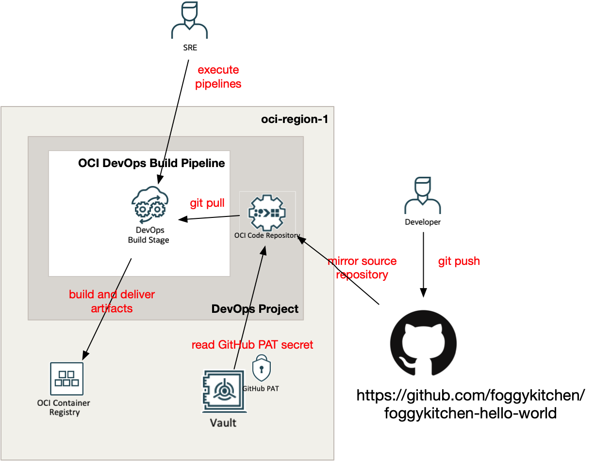
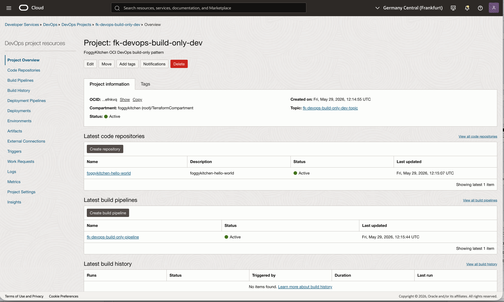
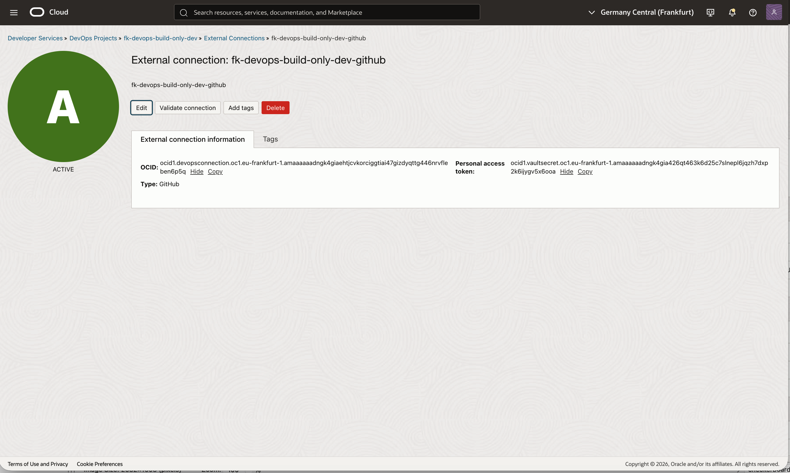
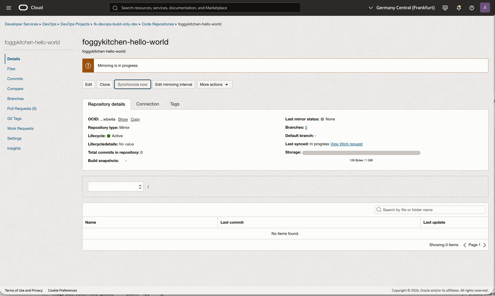

# OCI DevOps Build-Only Basic Example

This example is a thin wrapper around the shared **OCI DevOps build-only** pattern.

It demonstrates a minimal CI flow made of:

- one DevOps project
- one DevOps dynamic group plus minimal IAM policies for Vault, DevOps, and OCIR access
- one mirrored GitHub repository
- one OCIR repository
- one Docker deploy artifact
- one build pipeline with `BUILD` and `DELIVER_ARTIFACT` stages

## Files

- `landing-zone.yaml`: payload describing the build-only pattern
- `main.tf`: thin wrapper around the shared pattern
- `providers.tf`: OCI provider configuration
- `variables.tf`: provider inputs
- `outputs.tf`: useful outputs
- `terraform.tfvars.example`: example provider values

## Usage

```bash
cp terraform.tfvars.example terraform.tfvars
tofu init
tofu plan
```

## Architecture Overview



Figure 1. Public OCI DevOps build-only pattern using a GitHub source repository, Vault-backed PAT, OCI DevOps mirrored repository, build-and-deliver pipeline, and OCI Container Registry as the final image target.

## Notes

- `region` is the workload region for DevOps, OCIR, logging, and notifications
- `iam_home_region` is the OCI home region for IAM resources and defaults to `region` when omitted
- `devops.github.pat_secret_ocid` must point to an OCI Vault secret containing the GitHub personal access token
- `github_pat_secret_compartment_ocid` should point to the compartment that contains that Vault secret; it defaults to `compartment_ocid`
- `devops.iam.dynamic_group_name` provisions the service-side IAM required by OCI DevOps for Vault secret reads, OCIR access, and DevOps resource access
- `devops.iam.operator_group_name` is optional; if you set it, the pattern also provisions `Allow group <group-name> to use devops-connection in compartment ...`
- this public pattern intentionally stops before OKE deployment
- a follow-up public pattern will build on this with deploy environments and deploy pipelines

## OCI Console Verification



Figure 2. The DevOps project and external GitHub connection were created successfully in the workload region, with logging and notifications enabled for the project.



Figure 3. The build-only pipeline exists with the expected `build` and `deliver` stages and is ready for manual execution after the mirrored repository finishes synchronizing.



Figure 4. The mirrored repository is active, the last mirror status is `Passed`, the default branch is visible, and repository contents are now present in OCI DevOps.


Figure 5. The pipeline definition shows the intended two-stage flow: a managed build stage followed by a deliver-artifacts stage.


Figure 6. A manual build run completed successfully, with both `build` and `deliver` stages green and the execution log confirming image build and artifact delivery.


Figure 7. The DevOps project artifact remains active and points at the OCI Registry image path that the deliver stage publishes.


Figure 8. OCI Container Registry now contains the produced image version, proving the build-only pattern completed the full mirror -> build -> deliver -> registry flow.

## License

Licensed under the **Universal Permissive License (UPL), Version 1.0**.  
See [LICENSE](../../../../../LICENSE) for details.

© 2026 [FoggyKitchen.com](https://foggykitchen.com) - Cloud. Code. Clarity.
