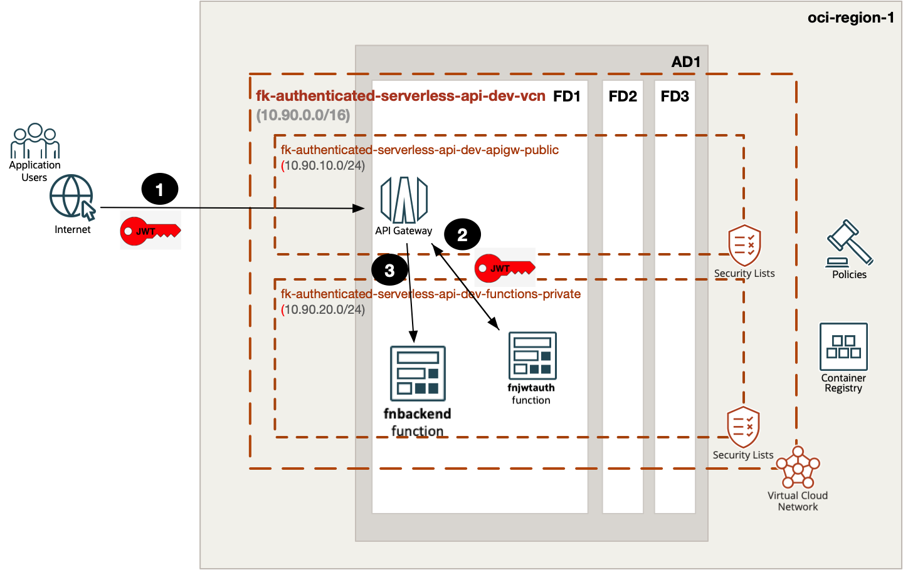
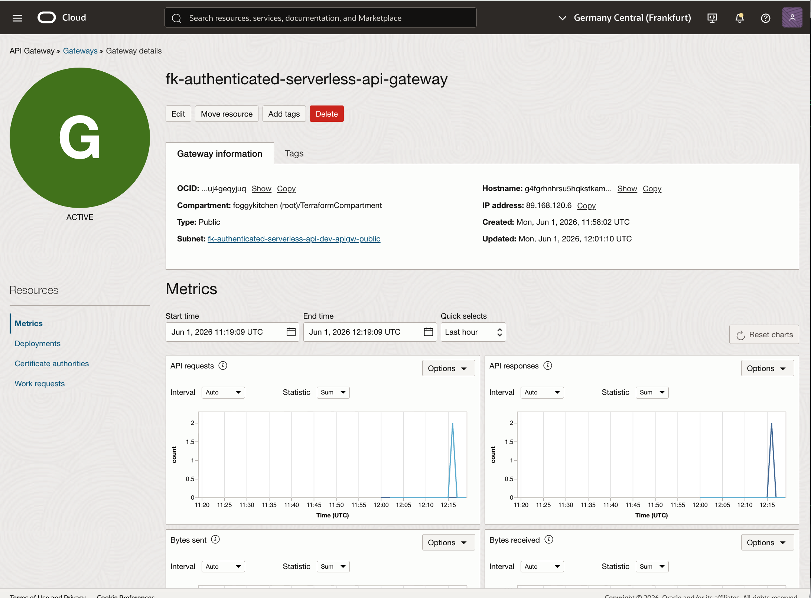
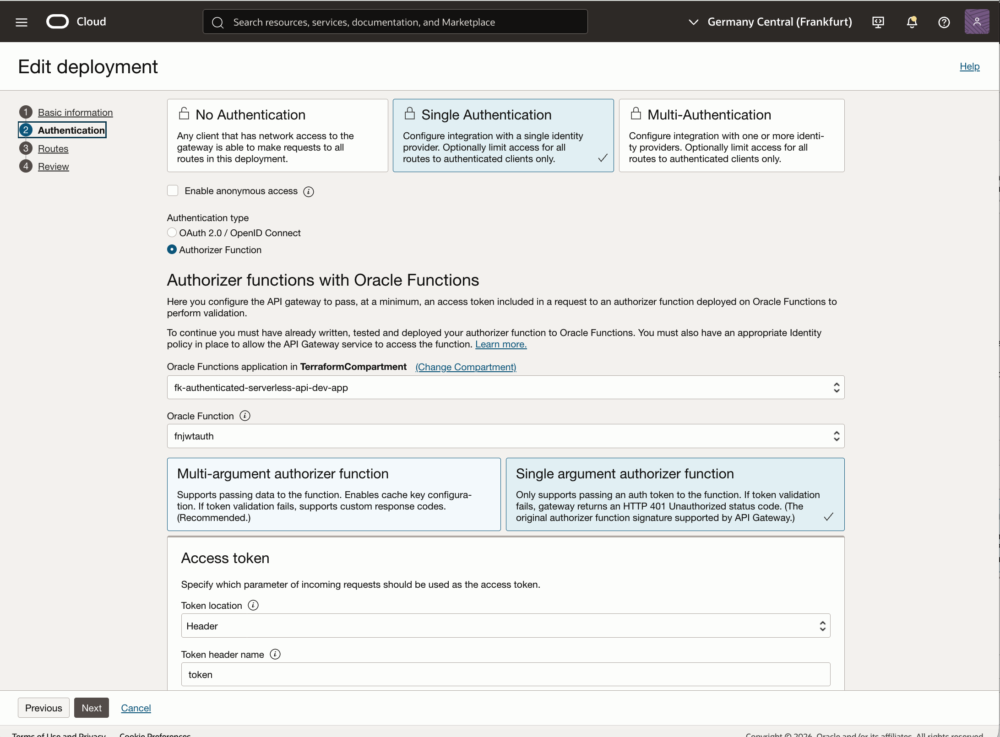
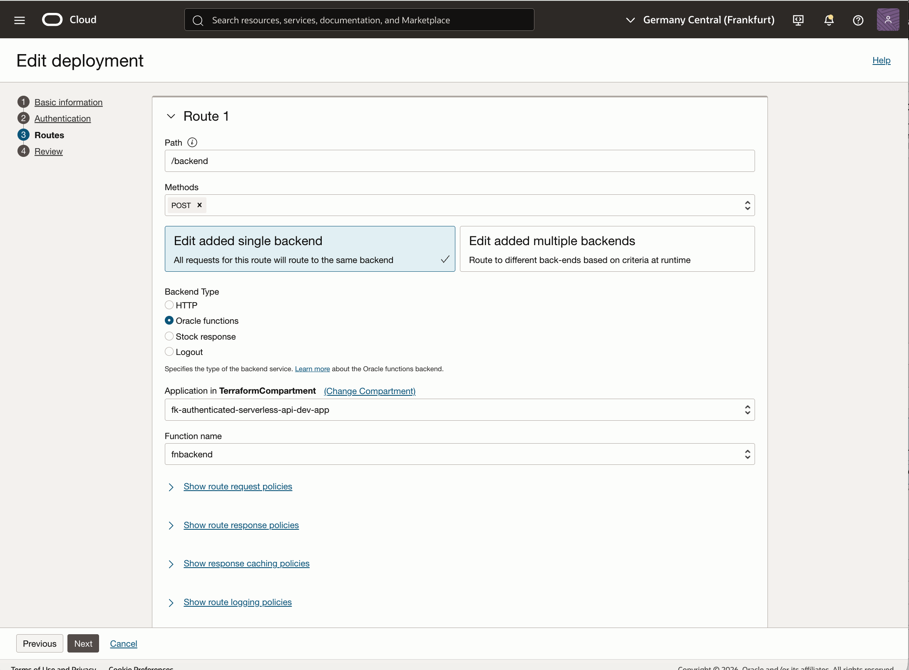
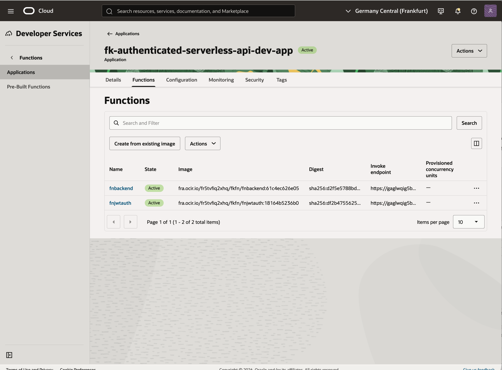

# OCI Authenticated Serverless API Basic Example

This example is a thin wrapper around the shared **authenticated_serverless_api** pattern.

It demonstrates:

- a public API Gateway entry point
- a private OCI Functions application
- a dedicated `fnjwtauth` custom authentication function
- a protected `fnbackend` route behind the authorizer

## Architecture Overview



Figure 1. `authenticated_serverless_api` runtime flow: an application user sends a request with a token to API Gateway, the gateway invokes `fnjwtauth` for custom authentication, and successful requests are forwarded to `fnbackend` in the private Functions subnet.

## Files

- `landing-zone.yaml`: payload describing the authenticated API pattern
- `main.tf`: thin wrapper around the shared pattern
- `providers.tf`: OCI provider configuration
- `variables.tf`: provider and secret inputs
- `outputs.tf`: useful outputs
- `terraform.tfvars.example`: example provider values
- `functions/`: custom auth and backend function sources

## Usage

```bash
cp terraform.tfvars.example terraform.tfvars
tofu init
tofu plan
```

## Validation Flow

After `tofu apply`, validate the pattern by:

1. calling the protected endpoint without the configured token and expecting `401`
2. calling the protected endpoint with the configured token in the `token` header and expecting `200`
3. confirming that `fnbackend` returns the protected JSON payload

The smoke test used for this example validated the deployed endpoint:

```bash
ENDPOINT="https://g4fgrhnhrsu5hqkstkamw45sm4.apigateway.eu-frankfurt-1.oci.customer-oci.com/v1/backend"
TOKEN="foggykitchen-demo-token"
```

Unauthenticated request:

```bash
curl -s -i -X POST "$ENDPOINT" \
  -H "Content-Type: application/json" \
  -d '{"hello":"world"}'
```

Expected result:

```http
HTTP/2 401
www-authenticate: API-key

{"code":401,"message":"Unauthorized"}
```

Authenticated request:

```bash
curl -s -i -X POST "$ENDPOINT" \
  -H "Content-Type: application/json" \
  -H "token: $TOKEN" \
  -d '{"hello":"world"}'
```

Expected result:

```http
HTTP/2 200

{"status":0,"fnbackend":"Finished","message":"Authenticated request accepted","input":{"hello":"world"}}
```

## OCI Console Verification



Figure 2. OCI API Gateway is active and exposes the authenticated public hostname used by the smoke test.



Figure 3. The API deployment uses `fnjwtauth` as the custom authorizer and reads the token from the `token` header.



Figure 4. The protected `/backend` route forwards authenticated requests to the `fnbackend` OCI Function.



Figure 5. The Functions application contains both `fnjwtauth` and `fnbackend`, which together implement the lightweight authenticated API flow.

## Notes

- this is intentionally a lightweight public pattern focused on access control and serverless ingress
- it does not include ADB, Streaming, SCH, or Object Storage
- the same token value is configured both in the auth function and in the test client request

## License

Licensed under the **Universal Permissive License (UPL), Version 1.0**.  
See [LICENSE](../../../../../../LICENSE) for details.

© 2026 [FoggyKitchen.com](https://foggykitchen.com) - Cloud. Code. Clarity.
