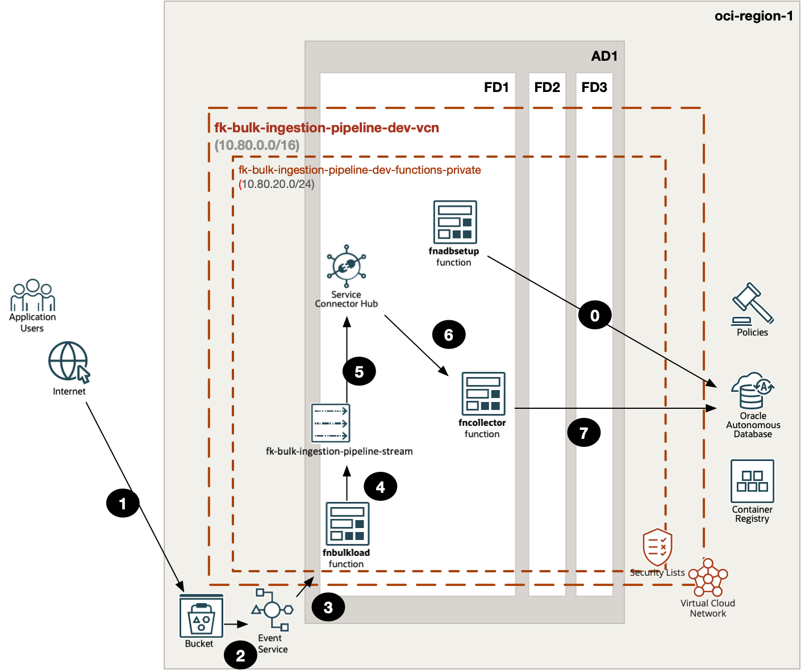
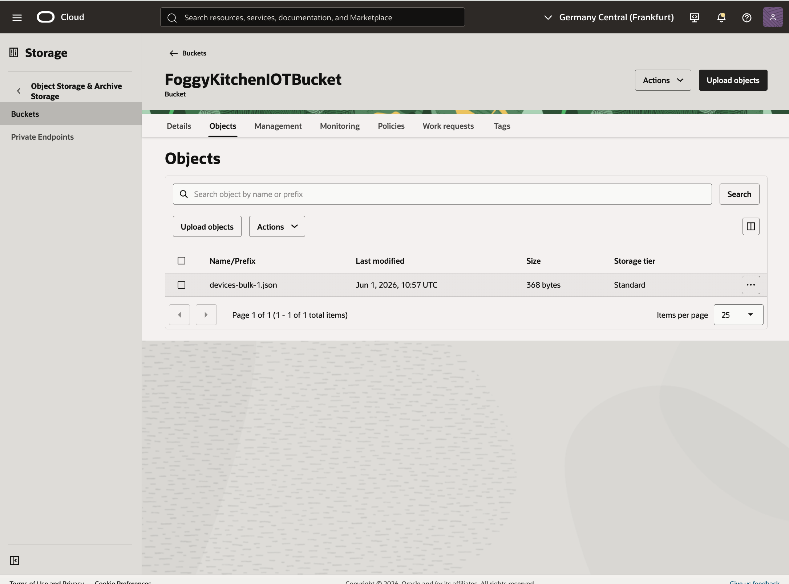
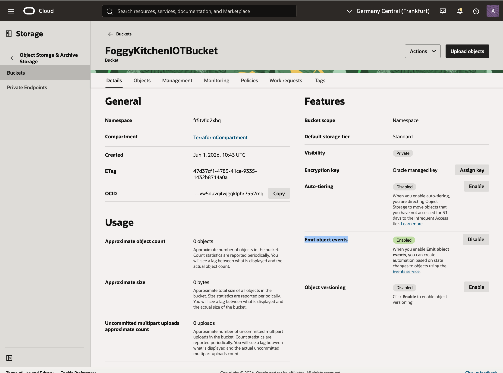
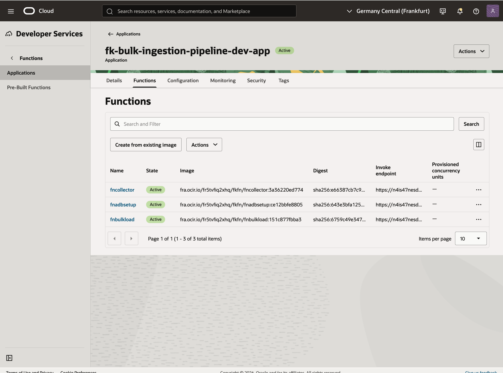
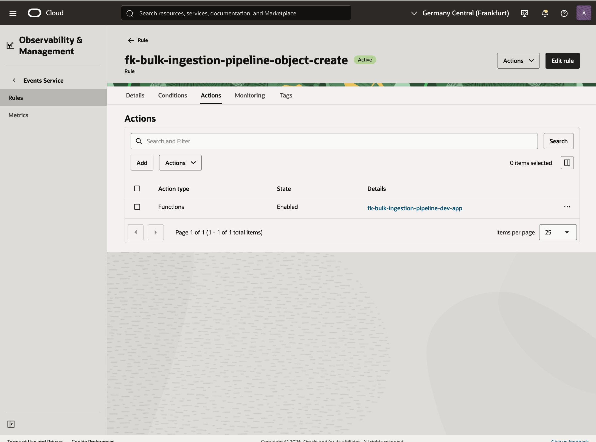
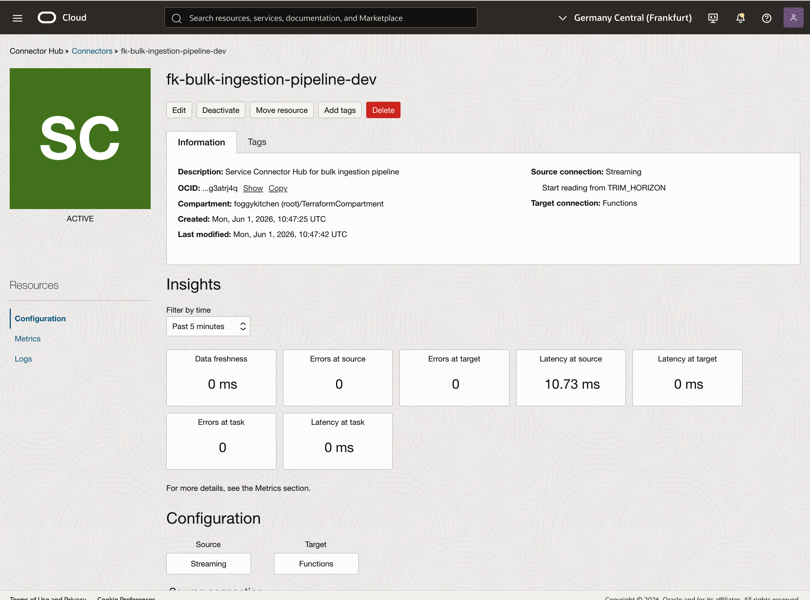
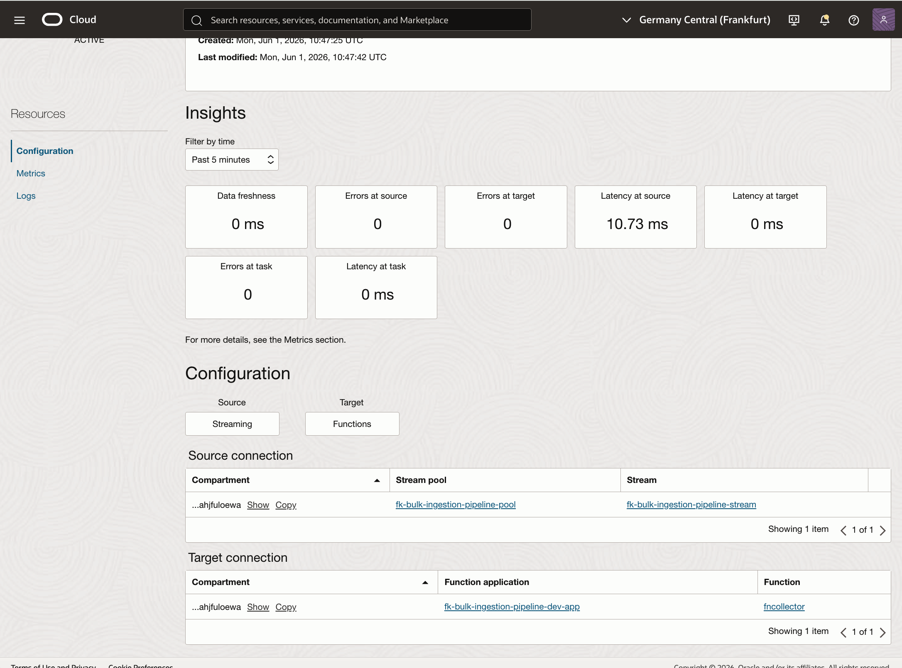
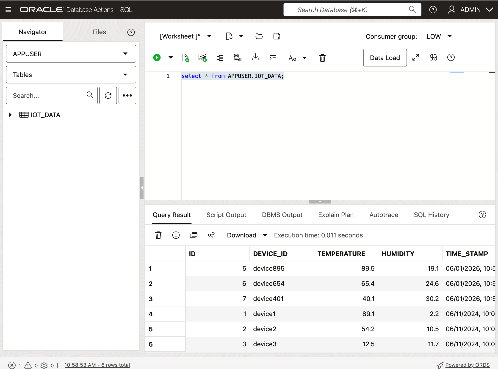

# OCI Bulk Ingestion Pipeline Basic Example

This example is a thin wrapper around the shared **bulk_ingestion_pipeline** pattern.

It demonstrates:

- a private OCI Functions application with `fnbulkload`, `fncollector`, and `fnadbsetup`
- an Object Storage bucket with object events enabled
- OCI Events invoking the bulk loader function
- asynchronous handoff through OCI Streaming
- Service Connector Hub delivery into the collector function
- persistence into Autonomous Database

## Architecture Overview



Figure 1. `bulk_ingestion_pipeline` runtime flow: `fnadbsetup` bootstraps ADB, a new object in the bucket triggers OCI Events, `fnbulkload` reads the file and publishes one message per record to Streaming, Service Connector Hub invokes `fncollector`, and the collector persists the final records in Autonomous Database.

## Files

- `landing-zone.yaml`: payload describing the bulk ingestion pattern
- `main.tf`: thin wrapper around the shared pattern
- `providers.tf`: OCI provider configuration
- `variables.tf`: provider and secret inputs
- `outputs.tf`: useful outputs
- `terraform.tfvars.example`: example provider values
- `functions/`: bulk loader, collector, and ADB bootstrap function sources

## Usage

```bash
cp terraform.tfvars.example terraform.tfvars
tofu init
tofu plan
```

## Validation Flow

After `tofu apply`, validate the pattern by:

1. uploading a JSON file into `FoggyKitchenIOTBucket`
2. confirming that OCI Events invokes `fnbulkload`
3. confirming that Service Connector Hub stays `ACTIVE`
4. verifying that the uploaded records are persisted in `APPUSER.IOT_DATA`

The smoke test used for this example uploaded a file containing:

- `device895`
- `device654`
- `device401`

and verified the final rows in Autonomous Database:

```text
('device895', 89.5, 19.1)
('device654', 65.4, 24.6)
('device401', 40.1, 30.2)
```

## OCI Console Verification



Figure 2. The Object Storage bucket `FoggyKitchenIOTBucket` is available and configured to emit object events for new uploads.



Figure 3. The Functions application contains the three runtime components used by this pattern: `fnbulkload`, `fncollector`, and `fnadbsetup`.



Figure 4. The OCI Events rule is enabled and routes `com.oraclecloud.objectstorage.createobject` events from the ingestion bucket to `fnbulkload`.



Figure 5. Service Connector Hub is `ACTIVE` and connects the stream source to the collector function target.



Figure 6. The connector wiring shows the expected bulk-ingestion handoff from Streaming to `fncollector`.



Figure 7. Autonomous Database is available and ready for both bootstrap and application-side inserts.



Figure 8. Final verification in `APPUSER.IOT_DATA` confirms that the uploaded JSON file was expanded into individual records and persisted successfully.

## Notes

- this example is intentionally based on the complete architecture explored in `lesson9`, but without API Gateway or `fninitiator`
- the ingestion entry point is the Object Storage bucket, not an HTTP endpoint
- ADB passwords are required because the pattern includes both bootstrap and application-side database access

## License

Licensed under the **Universal Permissive License (UPL), Version 1.0**.  
See [LICENSE](../../../../../LICENSE) for details.

© 2026 [FoggyKitchen.com](https://foggykitchen.com) - Cloud. Code. Clarity.
