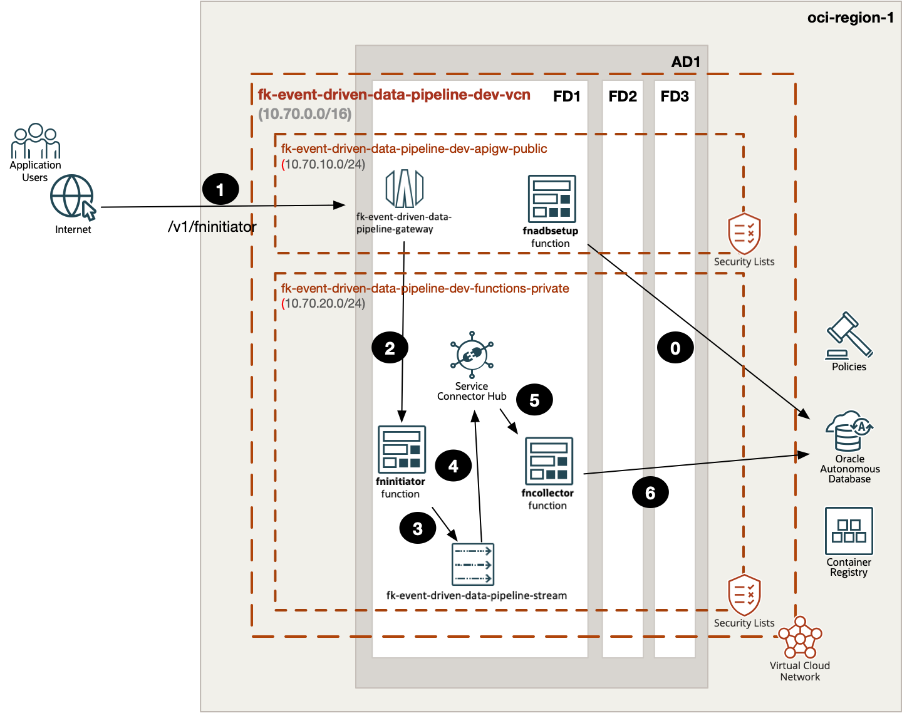
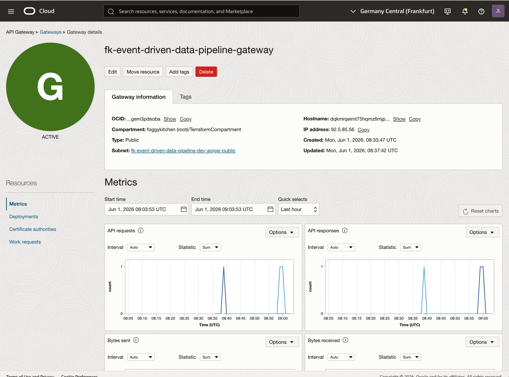
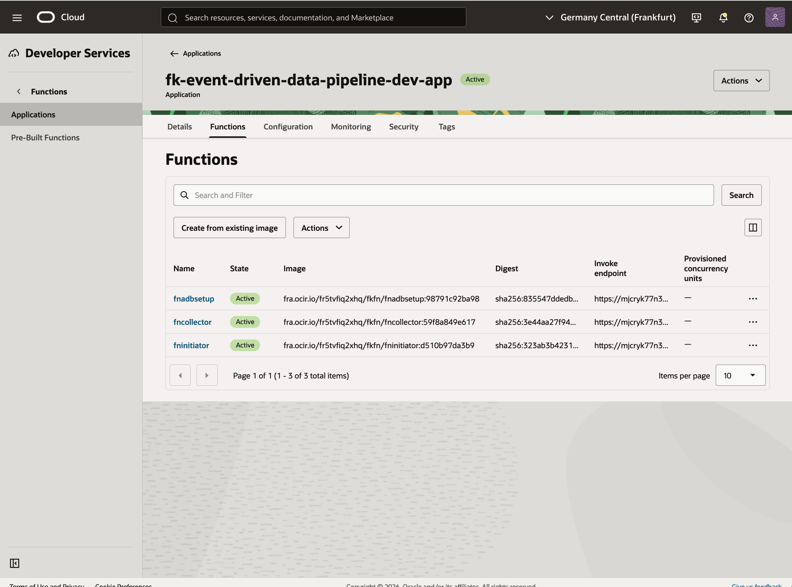
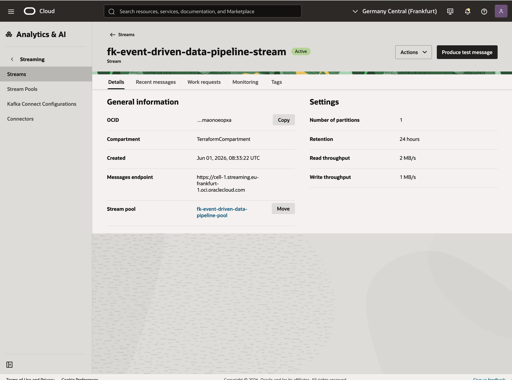
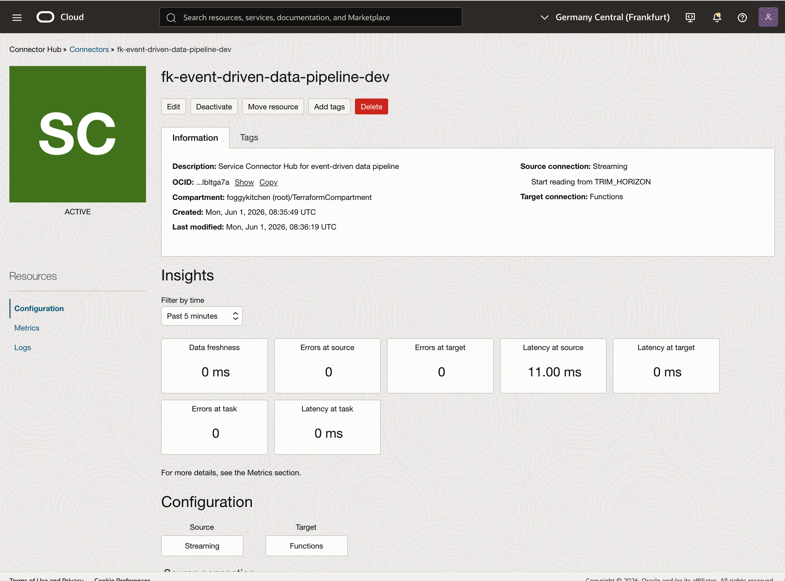
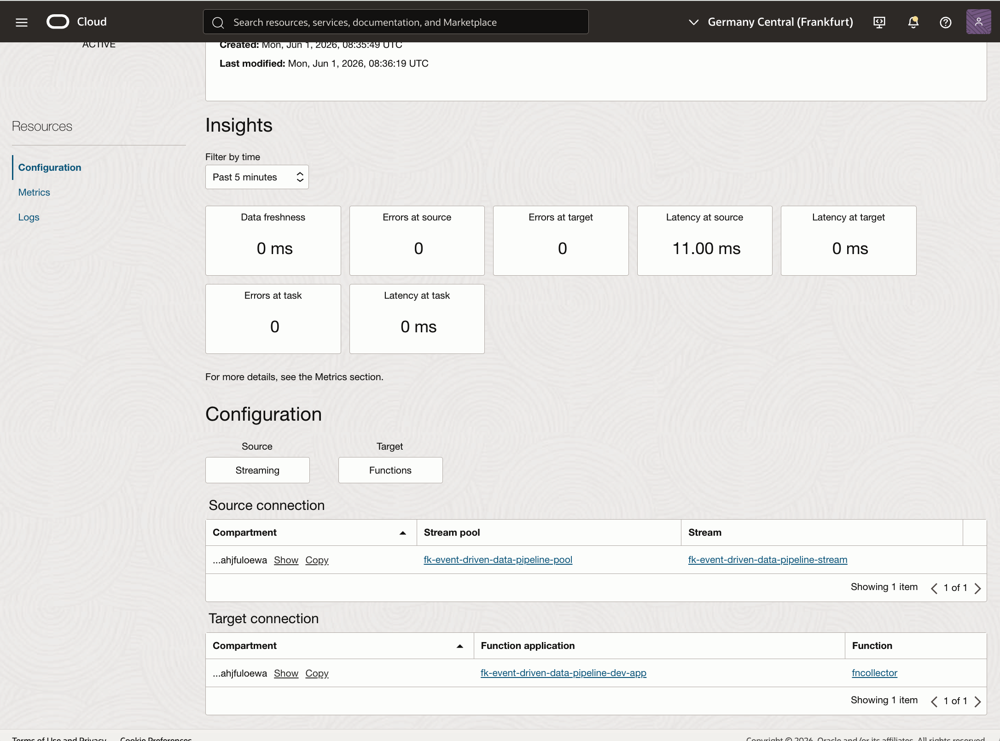
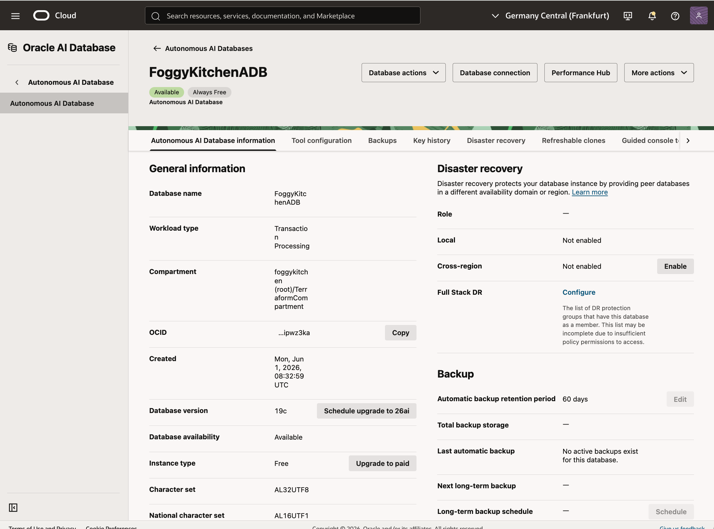
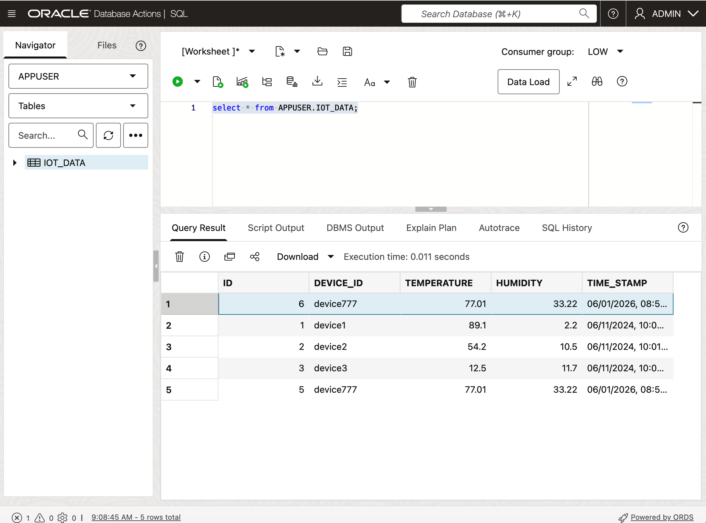

# OCI Event-Driven Data Pipeline Basic Example

This example is a thin wrapper around the shared **event_driven_data_pipeline** pattern.

It demonstrates:

- a public API Gateway entry point
- a private OCI Functions application with three functions
- asynchronous handoff through OCI Streaming
- Service Connector Hub delivery into a collector function
- persistence into Autonomous Database

## Architecture Overview



Figure 1. `event_driven_data_pipeline` runtime flow: `fnadbsetup` bootstraps ADB, `fninitiator` accepts the API request and writes to Streaming, Service Connector Hub invokes `fncollector`, and the collector persists the final record in Autonomous Database.

## OCI Console Verification



Figure 2. Public API Gateway `fk-event-driven-data-pipeline-gateway` is active and exposes the `fninitiator` route used for the smoke test.



Figure 3. Functions application `fk-event-driven-data-pipeline-dev-app` contains the three runtime components: `fninitiator`, `fncollector`, and `fnadbsetup`.



Figure 4. OCI Streaming provides the asynchronous handoff buffer used by the initiator function.



Figure 5. Service Connector Hub is active and connects the stream source to the collector function target.



Figure 6. The connector configuration shows the exact source stream and target function wiring for the runtime path.



Figure 7. Autonomous Database `FoggyKitchenADB` is available and acts as the persistence layer for processed records.



Figure 8. Database Actions confirms that the test payload reached `APPUSER.IOT_DATA`, including inserted `device777` rows.

## Files

- `landing-zone.yaml`: payload describing the event-driven data pipeline pattern
- `main.tf`: thin wrapper around the shared pattern
- `providers.tf`: OCI provider configuration
- `variables.tf`: provider and secret inputs
- `outputs.tf`: useful outputs
- `terraform.tfvars.example`: example provider values
- `functions/`: initiator, collector, and ADB bootstrap function sources

## Usage

```bash
cp terraform.tfvars.example terraform.tfvars
tofu init
tofu plan
```

## Notes

- this example is intentionally based on the complete architecture explored in `lesson7`
- the API route publishes only the initiator function; downstream processing is asynchronous
- ADB passwords are required because the pattern includes both bootstrap and application-side database access

## License

Licensed under the **Universal Permissive License (UPL), Version 1.0**.  
See [LICENSE](../../../../../LICENSE) for details.

© 2026 [FoggyKitchen.com](https://foggykitchen.com) - Cloud. Code. Clarity.
