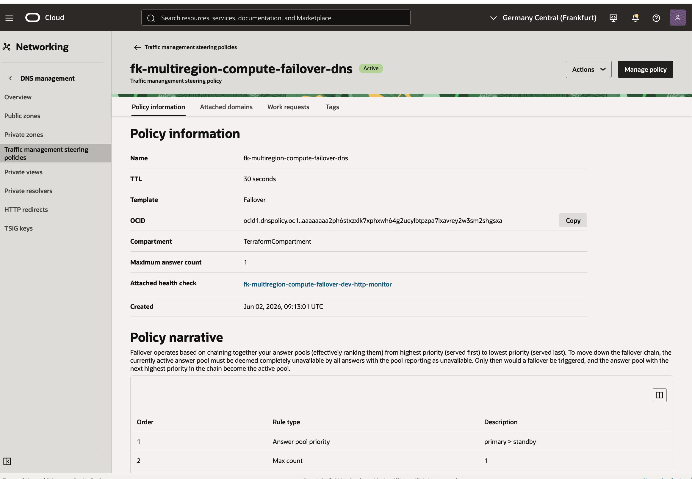
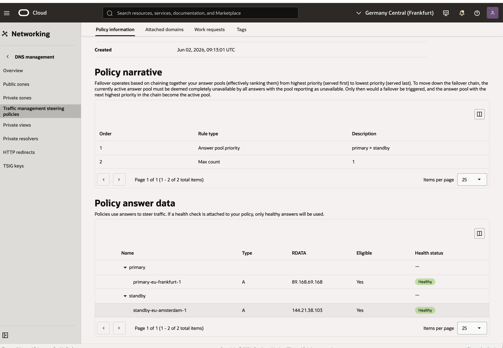
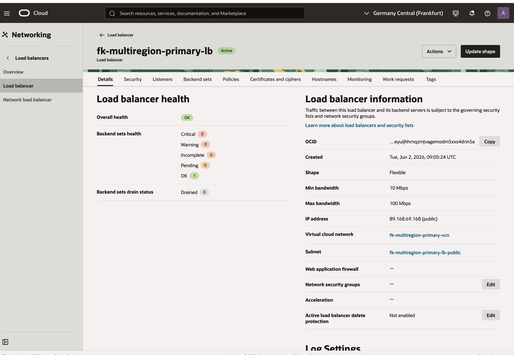
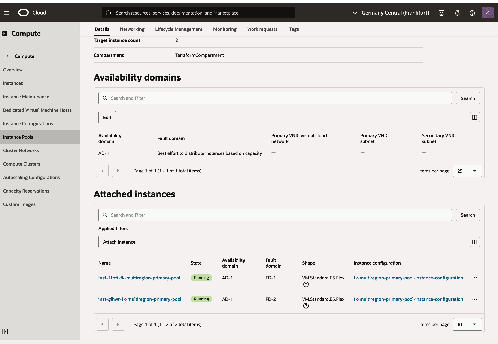
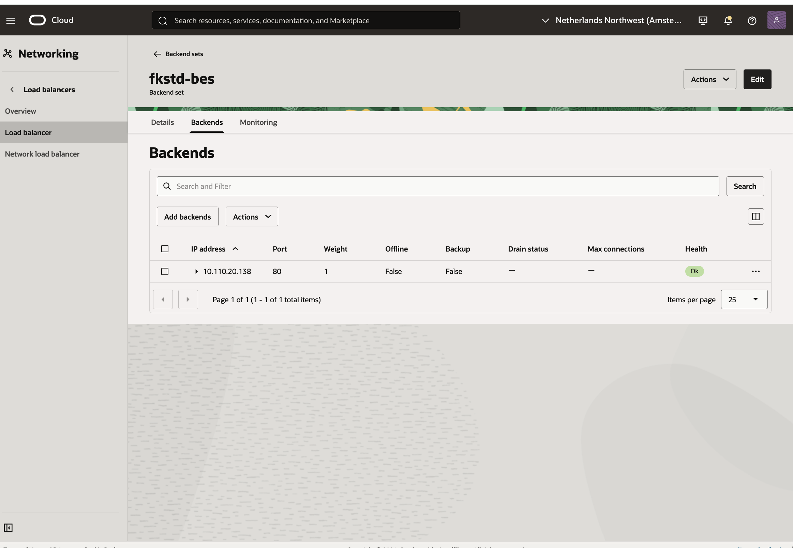
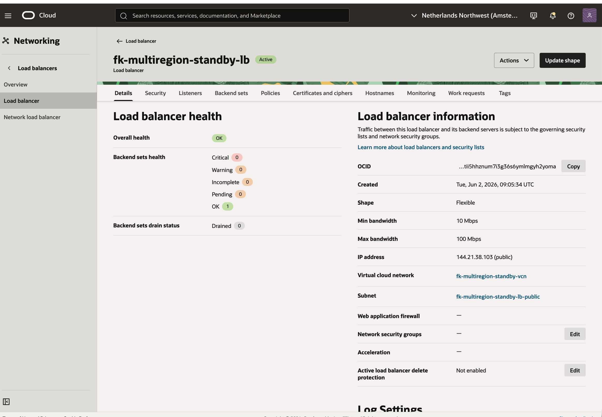
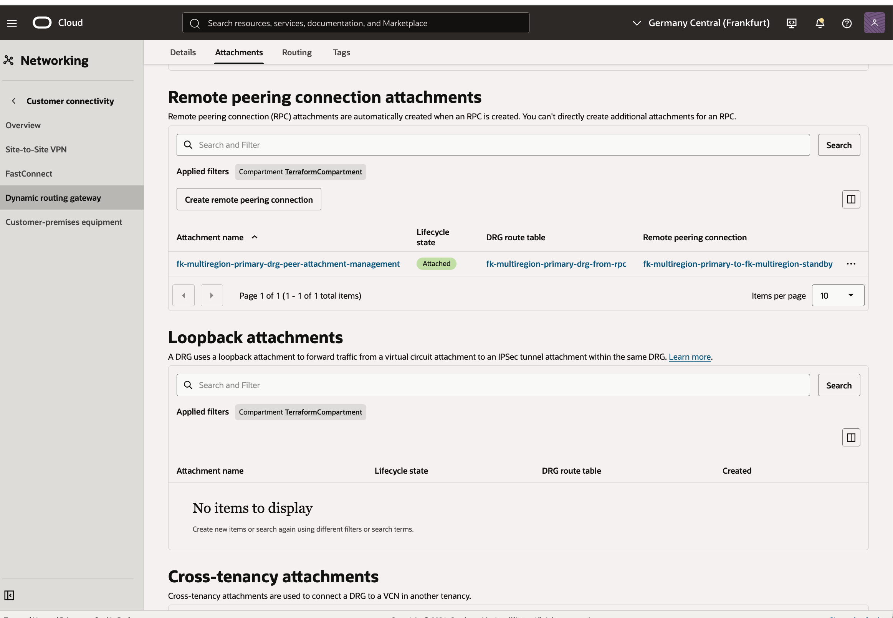

# OCI Multiregion Compute Failover Basic Example

This example is a thin wrapper around the shared **multiregion_compute_failover** pattern.

It demonstrates:

- primary and standby OCI regions
- DRG remote peering between both sites
- one public load balancer per site
- one instance pool per site
- OCI DNS Steering failover across the two load balancer endpoints
- optional threshold autoscaling per site

## Architecture Overview


Figure 1. `multiregion_compute_failover` runtime model: a primary site in `eu-frankfurt-1` and a standby site in `eu-amsterdam-1` each expose a public load balancer backed by an OCI instance pool, both VCNs are connected through DRG remote peering, and OCI DNS Steering performs failover between the two public entry points.

## OCI Console Verification



Figure 2. OCI DNS Steering policy overview showing the active failover template, attached health monitor, and the multiregion policy bound to the demo domain.



Figure 3. DNS steering answers and health state for both regions. The primary `eu-frankfurt-1` and standby `eu-amsterdam-1` public load balancer addresses are both healthy and eligible for failover.



Figure 4. Primary site load balancer in `eu-frankfurt-1` with public IP `89.168.69.168` and healthy backend set.



Figure 5. Primary instance pool running two application nodes behind the primary load balancer.



Figure 6. Standby site load balancer in `eu-amsterdam-1` with public IP `144.21.38.103`, ready to serve traffic after DNS failover.



Figure 7. Standby backend set showing a healthy backend instance that becomes active during failover.



Figure 8. Primary DRG remote peering attachment linking `eu-frankfurt-1` to the standby region over OCI Remote Peering Connections.

## Usage

```bash
cp terraform.tfvars.example terraform.tfvars
tofu init
tofu plan
```

## Notes

- this public pattern focuses on stateless cross-region failover
- it intentionally excludes file replication and database replication
- standby capacity is smaller by default to model a lightweight warm standby
- per-site autoscaling can be enabled with `primary_site.enable_autoscale` and `standby_site.enable_autoscale`
- the default workload is a minimal Python HTTP landing page, but you can inject site-specific bootstrap content with:
  - `workload.compute.cloud_init_override.primary`
  - `workload.compute.cloud_init_override.standby`
  - or per-site overrides under `primary_site.cloud_init_override` and `standby_site.cloud_init_override`

## License

Licensed under the **Universal Permissive License (UPL), Version 1.0**.  
See [LICENSE](../../../../../../LICENSE) for details.

© 2026 [FoggyKitchen.com](https://foggykitchen.com) - Cloud. Code. Clarity.
