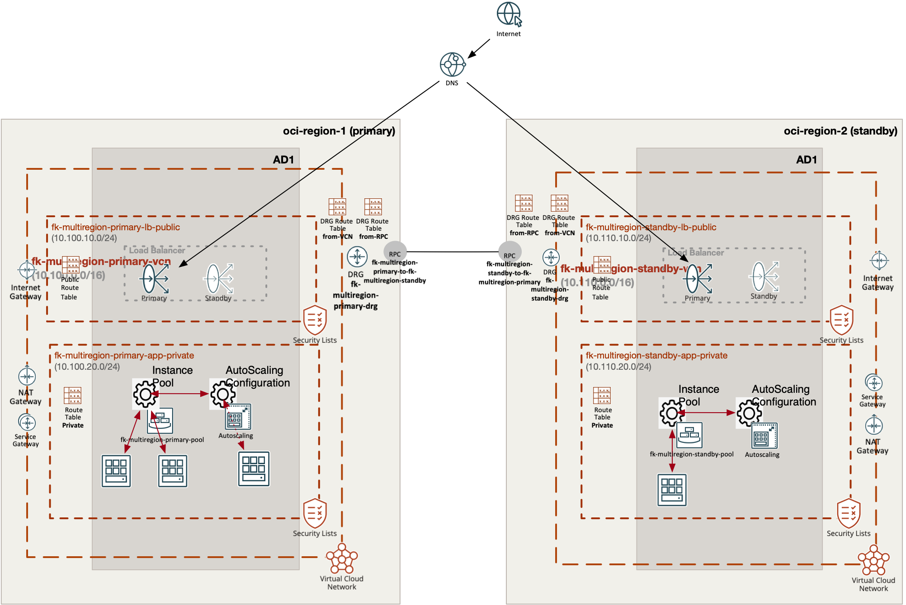

# OCI Multiregion Compute Failover Basic Example

This example is a thin wrapper around the shared **multiregion_compute_failover** pattern.

It demonstrates:

- primary and standby OCI regions
- DRG remote peering between both sites
- one public load balancer per site
- one instance pool per site
- OCI DNS Steering failover across the two load balancer endpoints
- optional threshold autoscaling per site

## Architecture Overview



Figure 1. `multiregion_compute_failover` runtime model: a primary site in `eu-frankfurt-1` and a standby site in `eu-amsterdam-1` each expose a public load balancer backed by an OCI instance pool, both VCNs are connected through DRG remote peering, and OCI DNS Steering performs failover between the two public entry points.

## Usage

```bash
cp terraform.tfvars.example terraform.tfvars
tofu init
tofu plan
```

## Notes

- this public pattern focuses on stateless cross-region failover
- it intentionally excludes file replication and database replication
- standby capacity is smaller by default to model a lightweight warm standby
- per-site autoscaling can be enabled with `primary_site.enable_autoscale` and `standby_site.enable_autoscale`

## License

Licensed under the **Universal Permissive License (UPL), Version 1.0**.  
See [LICENSE](../../../../../../LICENSE) for details.

© 2026 [FoggyKitchen.com](https://foggykitchen.com) - Cloud. Code. Clarity.
